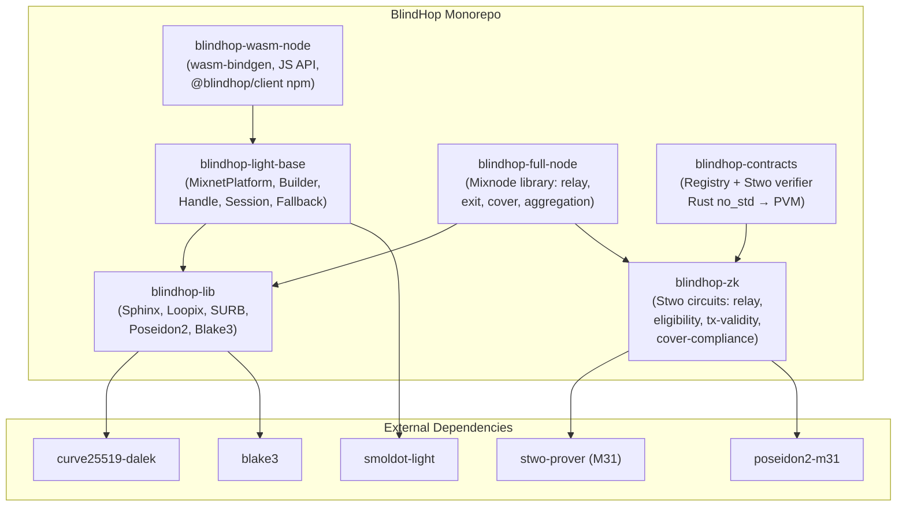

# Crate Structure

BlindHop is organized as a Rust workspace with **6 crates**, four of which mirror smoldot's existing structure.

## Dependency Graph



## Crate Descriptions

### `blindhop-lib` — Core Primitives

**Mirrors:** `smoldot` (`/lib`)

The foundational crate containing all protocol primitives. Zero network I/O — pure data structures and algorithms.

| Module | Contents |
|---|---|
| `sphinx/` | Sphinx packet construction, header encryption, payload encryption, SURB construction, packet fragmentation |
| `loopix/` | Poisson cover traffic generator, exponential delay sampling, stratified cascade strategy, traffic pattern manager |
| `mixnode/` | Mixnode identity, routing table, session management, discovery types, threshold engine |
| `crypto/` | Poseidon2 over M31 (in-circuit), Blake3 wrappers (networking) |
| `config.rs` | `BlindHopConfig` struct and `PrivacyMode` enum |

### `blindhop-light-base` — Light Client Integration

**Mirrors:** `smoldot-light` (`/light-base`)

The integration layer that wraps smoldot's `PlatformRef` trait.

| Module | Contents |
|---|---|
| `platform_wrapper.rs` | `MixnetPlatform<P>` — the core PlatformRef wrapper |
| `builder.rs` | `BlindHopBuilder` — ergonomic configuration API |
| `handle.rs` | `BlindHopHandle` — runtime privacy controls |
| `session.rs` | Session tracker — era rotation, key refresh |
| `fallback.rs` | Failure policy engine (Required vs BestEffort) |
| `proof_fetcher.rs` | Async DHT proof retrieval |

### `blindhop-wasm-node` — JS/Wasm Bindings

**Mirrors:** `smoldot-light-js` (`/wasm-node`)

Published as `@blindhop/client` on npm.

| File | Contents |
|---|---|
| `src/lib.rs` | `#[wasm_bindgen]` entry point |
| `js/index.js` | JavaScript wrapper API |
| `js/index.d.ts` | TypeScript definitions |
| `js/package.json` | npm package manifest |

### `blindhop-full-node` — Mixnode Library

**Mirrors:** `smoldot-full-node` (`/full-node`)

A library that Substrate full nodes integrate to become mixnodes.

| Module | Contents |
|---|---|
| `relay.rs` | Sphinx relay engine with priority delay queue |
| `exit.rs` | Exit node: extract request → RPC → SURB reply |
| `cover.rs` | Cover loop generation with compliance tracking |
| `aggregation.rs` | Binary proof tree aggregation coordinator |
| `dht.rs` | Kademlia DHT proof storage/retrieval |
| `integration.rs` | `MixnodePlugin` trait for full node integration |

### `blindhop-zk` — Zero-Knowledge Circuits

**New crate** — no smoldot mirror.

| Module | Contents |
|---|---|
| `circuits/relay_proof.rs` | Correct Sphinx relay circuit (Stwo/M31) |
| `circuits/eligibility_proof.rs` | Validator/registry membership circuit |
| `circuits/tx_validity_proof.rs` | Well-formed extrinsic circuit |
| `circuits/cover_compliance_proof.rs` | Cover traffic compliance circuit |
| `recursion/binary_tree.rs` | Binary proof tree coordinator |
| `recursion/aggregation_circuit.rs` | Recursive Stwo verifier circuit |
| `recursion/root_proof.rs` | Root proof finalization |

### `blindhop-contracts` — PolkaVM Smart Contracts

**New crate** — no smoldot mirror. Compiled to RISC-V PVM bytecode.

| Module | Contents |
|---|---|
| `registry.rs` | Staking, registration, eligibility checkpoints, slashing, mixnode enumeration |
| `verifier.rs` | Stwo M31 sumcheck verifier (Rust `no_std`) |
| `adapter.rs` | rEVM Solidity ABI translation adapter |

## Repository Layout

```
blindhop/
├── Cargo.toml                      # Workspace root
├── LICENSE-APACHE
├── LICENSE-MIT
├── README.md
│
├── lib/                            # blindhop-lib
│   ├── Cargo.toml
│   └── src/
│       ├── lib.rs
│       ├── config.rs               # BlindHopConfig, PrivacyMode, ChainType
│       ├── sphinx/
│       │   ├── mod.rs
│       │   ├── packet.rs           # 2 KB Sphinx packet construction
│       │   ├── header.rs           # Routing header encryption
│       │   ├── payload.rs          # Payload encryption/decryption
│       │   ├── surb.rs             # SURB construction + processing
│       │   └── fragment.rs         # Fragmentation + reassembly
│       ├── loopix/
│       │   ├── mod.rs
│       │   ├── cover.rs            # Poisson cover traffic generator
│       │   ├── delay.rs            # Exponential delay sampling
│       │   ├── strategy.rs         # Stratified cascade assignment
│       │   └── traffic.rs          # Traffic pattern manager
│       ├── mixnode/
│       │   ├── mod.rs
│       │   ├── identity.rs         # Mixnode key management
│       │   ├── routing.rs          # Routing table (dual-class pool)
│       │   ├── session.rs          # Session/era management
│       │   ├── discovery.rs        # Validator + standalone discovery
│       │   └── threshold.rs        # Per-chain anonymity set threshold
│       └── crypto/
│           ├── poseidon2.rs        # Poseidon2 over M31 (in-circuit)
│           └── blake3.rs           # Blake3 wrappers (networking)
│
├── light-base/                     # blindhop-light-base
│   ├── Cargo.toml
│   └── src/
│       ├── lib.rs
│       ├── platform_wrapper.rs     # MixnetPlatform<P: PlatformRef>
│       ├── builder.rs              # BlindHopBuilder
│       ├── handle.rs               # BlindHopHandle (runtime controls)
│       ├── session.rs              # Session tracker + key refresh
│       ├── fallback.rs             # Privacy mode failure policy
│       └── proof_fetcher.rs        # Async DHT proof retrieval
│
├── wasm-node/                      # blindhop-wasm-node
│   ├── Cargo.toml
│   ├── src/
│   │   └── lib.rs                  # wasm_bindgen entry point
│   └── js/
│       ├── index.js                # JS wrapper
│       ├── index.d.ts              # TypeScript definitions
│       ├── package.json            # @blindhop/client
│       └── demo.html               # Interactive demo page
│
├── full-node/                      # blindhop-full-node
│   ├── Cargo.toml
│   └── src/
│       ├── lib.rs
│       ├── relay.rs                # Sphinx relay engine + delay queue
│       ├── exit.rs                 # Exit node logic
│       ├── cover.rs                # Cover loop generation
│       ├── aggregation.rs          # Binary proof tree aggregation
│       ├── dht.rs                  # Kademlia DHT proof storage
│       └── integration.rs          # MixnodePlugin trait
│
├── zk/                             # blindhop-zk
│   ├── Cargo.toml
│   └── src/
│       ├── lib.rs
│       ├── circuits/
│       │   ├── mod.rs
│       │   ├── relay_proof.rs      # Correct packet relay (Stwo/M31)
│       │   ├── eligibility_proof.rs # Mixnode eligibility (Stwo/M31)
│       │   ├── tx_validity_proof.rs # Well-formed extrinsic (Stwo/M31)
│       │   └── cover_compliance_proof.rs
│       └── recursion/
│           ├── mod.rs
│           ├── binary_tree.rs      # Tree coordinator
│           ├── aggregation_circuit.rs # Recursive Stwo verifier
│           └── root_proof.rs       # Root proof finalization
│
├── contracts/                      # blindhop-contracts
│   ├── Cargo.toml
│   └── src/
│       ├── lib.rs
│       ├── registry.rs             # BlindHop Registry (staking, slashing)
│       ├── verifier.rs             # Stwo M31 sumcheck verifier (no_std → PVM)
│       └── adapter.rs              # rEVM translation adapter (Solidity ABI)
│
└── tests/                          # Integration tests
    ├── sphinx_roundtrip.rs         # Packet encode → multi-hop decrypt
    ├── mixnet_e2e.rs               # Full mixnet path with SURBs
    ├── zk_circuits.rs              # All 4 circuit constraint tests
    ├── binary_tree_aggregation.rs  # Proof tree assembly + verification
    └── contract_integration.rs     # Registry + verifier on-chain flow
```

