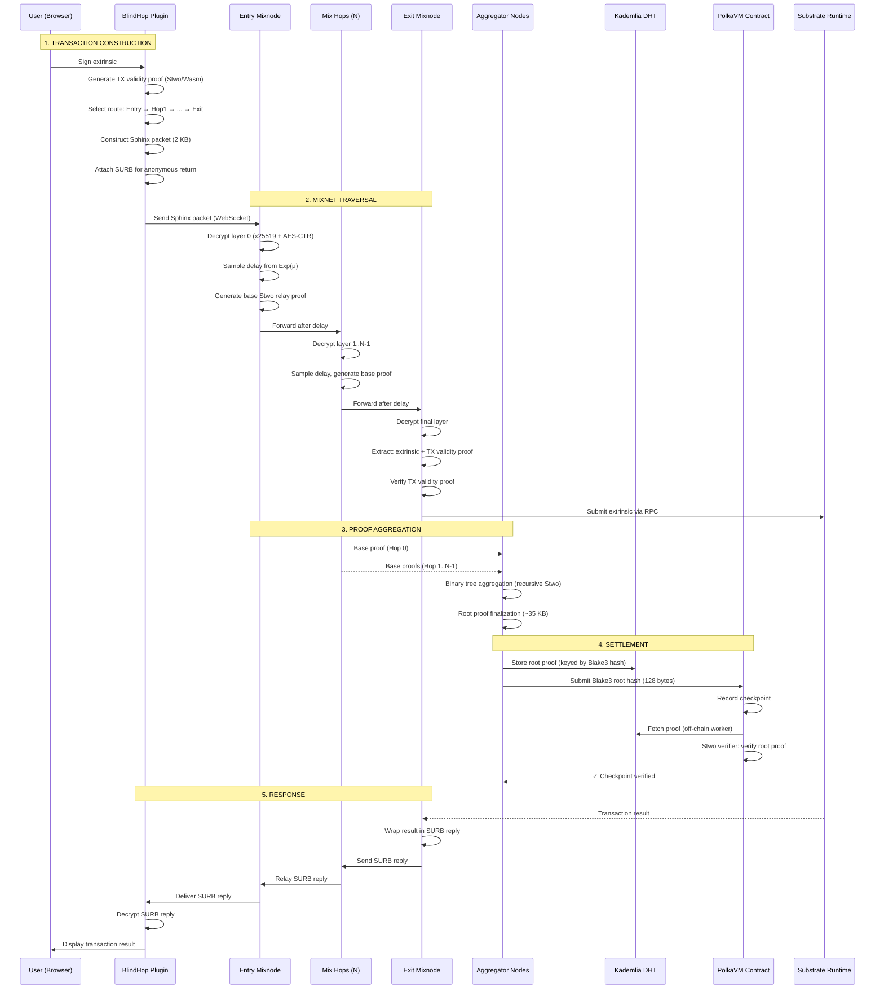

# End-to-End Data Flow

This page traces a single anonymous transaction from user intent to on-chain finality.

## Complete Sequence

## Phase-by-Phase Breakdown

### Phase 1: Transaction Construction (Client-Side)

1. The dApp calls `client.sendJsonRpc()` with a signed extrinsic
2. `MixnetPlatform` intercepts the outbound request
3. A **TX validity proof** is generated in Wasm (Stwo, ~2 seconds):
   - Proves the extrinsic is well-formed (valid encoding, correct nonce range)
   - Public input: Blake3 commitment to the extrinsic hash
4. A **route is selected** randomly: one mixnode per layer from the cascade
5. A **Sphinx packet** is constructed:
   - Each hop gets an encrypted routing header (x25519 shared secret)
   - Payload encrypted in onion layers (AES-CTR)
   - Padded to exactly **2048 bytes** (uniform size)
6. A **SURB** (Single-Use Reply Block) is attached for the anonymous return path

### Phase 2: Mixnet Traversal

At each hop, the mixnode:

1. Receives the 2 KB Sphinx packet
2. Uses its session private key to derive the shared secret (x25519 ECDH)
3. Decrypts the routing header to find the next hop
4. Decrypts/re-encrypts the payload (peel one onion layer)
5. Samples a delay from Exp(μ) and queues the packet
6. After the delay, forwards the modified packet to the next hop
7. Generates a **base Stwo relay proof** attesting to correct processing

### Phase 3: Proof Aggregation (Binary Tree)

Aggregator nodes (idle mixnodes, selected round-robin) build the proof tree:

1. **Layer 0**: Collect all base proofs from the hops
2. **Layer 1**: Pair adjacent proofs → recursive Stwo verification → aggregated proof
3. **Layer 2+**: Continue pairing until a single **root proof** (~35 KB) remains
4. Store root proof in **Kademlia DHT** by its Blake3 hash

### Phase 4: Settlement

1. The exit node or aggregator submits the **128-byte Blake3 root hash** on-chain
2. The PolkaVM Registry contract records the checkpoint
3. An off-chain worker fetches the ~35 KB proof from the DHT
4. The Stwo verifier contract validates the root proof (< 10ms)
5. The checkpoint is marked as verified

### Phase 5: Response

1. The Substrate runtime processes the extrinsic and returns a result
2. The exit node wraps the result in the pre-built **SURB reply**
3. The SURB reply traverses the mixnet in reverse (each hop peels a layer)
4. The client decrypts the final SURB reply using the pre-computed SURB key
5. The dApp receives the transaction result

## Latency Budget

| Phase | Duration | Notes |
|---|---|---|
| TX validity proof (client) | ~2,000 ms | Stwo in Wasm, one-time per tx |
| Sphinx packet construction | ~5 ms | Fast symmetric crypto |
| Per-hop delay (mean) | ~500 ms × N hops | Configurable via μ |
| Per-hop proving | ~50 ms | Stwo base proof, concurrent |
| Binary tree aggregation | ~100 ms × log₂(N) | Recursive Stwo |
| SURB return path | ~500 ms × N hops | Same delays as forward path |
| **Total (3 hops)** | **~5,000 ms** | **Under 5-second target** |
