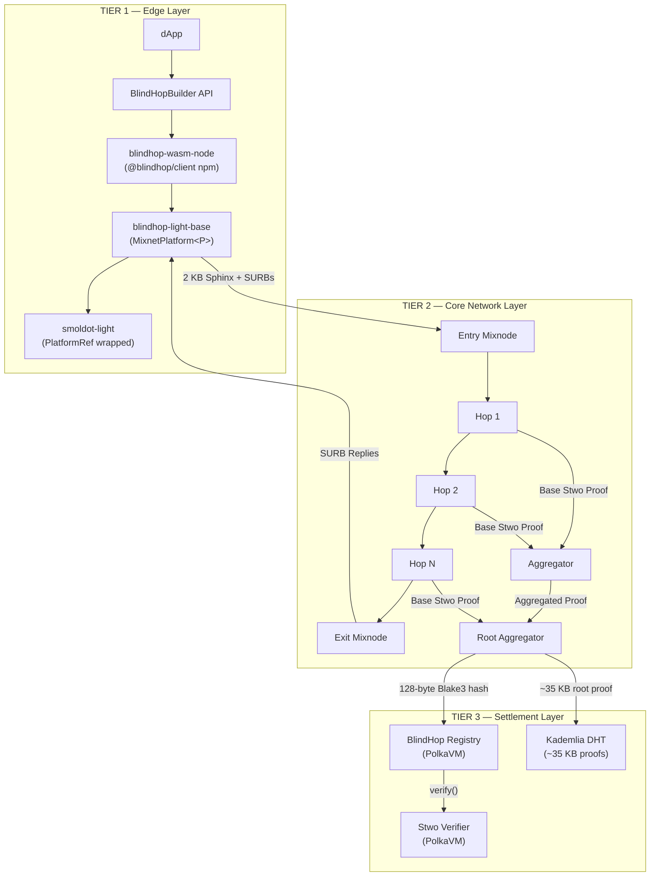

# Architecture Overview

BlindHop uses a **3-tier architecture** that cleanly separates concerns between the light client, the decentralized mixnet, and on-chain settlement.

## System Diagram

## Tier 1: Edge Layer

The **Edge Layer** runs in the user's browser (or Node.js/Deno). It is responsible for:

| Responsibility | Implementation |
|---|---|
| Wrapping smoldot | `MixnetPlatform<P: PlatformRef>` intercepts all connections |
| Sphinx packet construction | x25519 key exchange → AES-CTR encryption → uniform 2 KB packets |
| SURB management | Pre-built return headers attached to outgoing packets |
| Cover traffic generation | Poisson-distributed dummy packets at rate λ |
| TX validity proof | Client generates a minimal ZK proof of well-formed extrinsic (Wasm) |
| Async proof retrieval | Pull-based fetching of ~35 KB root proofs from DHT |

**Key constraint**: Everything must run in WebAssembly. No native dependencies. The Stwo verifier is compiled to Wasm for client-side root proof verification.

## Tier 2: Core Network Layer

The **Core Layer** is the decentralized mixnet — a set of mixnodes operated by validators and standalone operators.

| Responsibility | Implementation |
|---|---|
| Sphinx relay | Decrypt one layer → apply exponential delay → forward |
| Base proof generation | Each hop generates a Stwo Circle STARK relay proof |
| Binary tree aggregation | Pairs of proofs aggregated recursively → single root proof |
| Cover loop generation | Mixnodes generate self-looping cover traffic |
| DHT proof storage | Store ~35 KB root proofs by Blake3 hash in Kademlia |

**Key design**: Proofs are generated **concurrently** by each hop and aggregated in a **binary tree** — giving O(log N) latency instead of O(N) sequential folding.

## Tier 3: Settlement Layer

The **Settlement Layer** runs on-chain via PolkaVM smart contracts on Asset Hub.

| Responsibility | Implementation |
|---|---|
| Operator registry | Standalone registration, staking bonds, mixnode enumeration |
| Proof verification | Stwo M31 sumcheck verifier (Rust `no_std` → RISC-V PVM) |
| Eligibility checkpoints | Periodic on-chain proof submission for dispute resolution |
| Slashing | Fraud proof verification → bond confiscation |
| rEVM adapter | Solidity ABI translation for MetaMask/EVM wallet compatibility |

**Key constraint**: Zero new pallets. All logic deploys as `pallet-revive` smart contracts.

## Data Flow Summary

1. **User submits tx** → wrapped in 2 KB Sphinx packet with SURB
2. **Packet traverses mixnet** → each hop decrypts, delays, forwards, generates base proof
3. **Aggregators build proof tree** → O(log N) recursive composition → ~35 KB root proof
4. **Root proof stored in DHT** → Blake3 hash committed on-chain (128 bytes)
5. **Exit node delivers tx** → to full node RPC → blockchain processes it
6. **Response returns via SURB** → anonymous return path → user receives result
