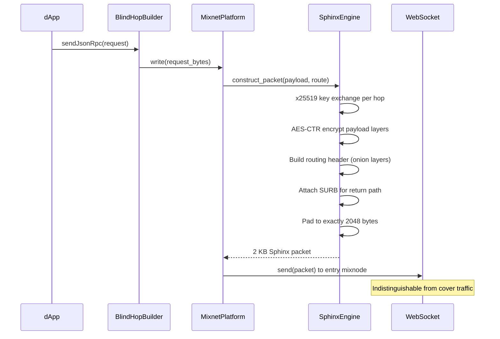
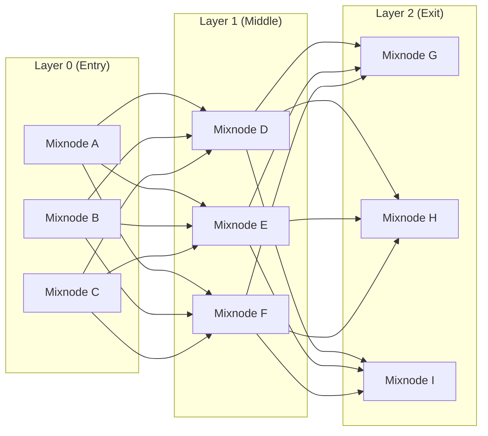

# Three-Tier Architecture Deep Dive

## Tier 1: Edge Layer — Smoldot Integration

### PlatformRef Wrapping Strategy

BlindHop integrates with smoldot by implementing a **wrapper** around the `PlatformRef` trait — smoldot's abstraction over platform-specific I/O (TCP, WebSocket, DNS, etc.).

```rust
/// Wraps any PlatformRef to route all connections through the mixnet.
pub struct MixnetPlatform<P: PlatformRef> {
    inner: P,
    config: BlindHopConfig,
    sphinx_engine: SphinxEngine,
    cover_generator: CoverTrafficGenerator,
    surb_pool: SurbPool,
    session_tracker: SessionTracker,
    proof_fetcher: ProofFetcher,
}

impl<P: PlatformRef> PlatformRef for MixnetPlatform<P> {
    // All connection methods intercepted:
    // - connect() → Sphinx packet to entry mixnode
    // - read() → SURB reply decryption
    // - write() → Sphinx packet construction
    // Every I/O operation is routed through the mixnet
}
```

**Why wrapping, not forking?**

| Approach | Pros | Cons |
|---|---|---|
| **Fork smoldot** | Full control | Must track upstream changes forever |
| **Modify smoldot** | Tight integration | Upstream may reject changes |
| **Wrap PlatformRef** ✓ | Non-invasive, upgradeable | Slight overhead from abstraction |

The wrapping approach means BlindHop automatically inherits all smoldot improvements without code changes.

### Packet Lifecycle (Client Side)



## Tier 2: Core Network — Mixnode Operations

### Stratified Cascade Topology

Mixnodes are organized into **layers** (strata) forming a cascade:



The client randomly selects **one node per layer**, constructing a path like `E2 → M1 → X3`. This ensures:

- No single node sees both sender and receiver
- Traffic from all senders is mixed at each layer
- Even colluding nodes in the same layer cannot correlate traffic

### Delay Queue Architecture

Each mixnode maintains a **priority delay queue**:

```rust
struct DelayQueue {
    /// Packets sorted by scheduled_send_time
    heap: BinaryHeap<DelayedPacket>,
}

struct DelayedPacket {
    packet: SphinxPacket,
    scheduled_send_time: Instant,  // now + sampled_delay
}
```

The delay is sampled from an **exponential distribution** with parameter μ:

$$
\text{delay} \sim \text{Exp}(\mu)
$$

This ensures that:
- Packets are reordered (preventing timing correlation)
- The distribution is memoryless (observing one delay gives no information about future delays)
- Mean delay is configurable per-network (μ = 500ms recommended for Kusama)

## Tier 3: Settlement — PolkaVM Contracts

### Why PolkaVM Instead of Pallets?

| Aspect | Pallet | PolkaVM Contract |
|---|---|---|
| Deployment | Requires runtime upgrade | Deploy via extrinsic (permissionless) |
| Upgrades | Governance vote | Contract owner or proxy |
| Performance | Direct FRAME access | ~80% bare-metal via RISC-V JIT |
| Cost | Free (part of runtime) | Gas-metered |
| Portability | One chain only | Any chain with `pallet-revive` |
| Auditability | Part of monolithic runtime | Isolated, self-contained |

For BlindHop, **PolkaVM contracts** are the right choice because:
1. **Permissionless deployment** — any chain can opt in without governance
2. **Cross-chain portability** — same contracts deploy on Kusama, Polkadot, any Asset Hub
3. **Isolation** — bugs in BlindHop contracts don't affect the runtime
4. **No upstream dependency** — don't need smoldot/Substrate to accept our pallet

### On-Chain Data Footprint

BlindHop is designed for **minimal on-chain data**:

| Data | Size | Frequency |
|---|---|---|
| Root proof Blake3 hash | 128 bytes | Per proof batch |
| Standalone operator registration | ~256 bytes | On registration |
| Eligibility checkpoint proof | ~128 bytes (hash) | Every N sessions |
| Slashing fraud proof | ~256 bytes | On dispute |

The ~35 KB root proof itself is **never stored on-chain** — it lives in the Kademlia DHT and is self-authenticating via its Blake3 hash.
