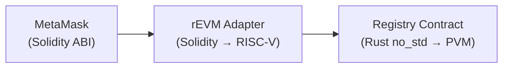

# rEVM Translation Adapter

The **rEVM Adapter** is a lightweight Solidity interface that enables MetaMask and other EVM wallets to interact with the BlindHop Registry contract.

## Role

**rEVM runs no mixnet logic.** It is strictly a translation layer:



`pallet-revive` translates Solidity ABI calls into RISC-V instructions, which then call the native PolkaVM Registry contract.

## Solidity Interface

```solidity
// SPDX-License-Identifier: Apache-2.0
interface IBlindHopRegistry {
    function register(bytes32 publicKey, uint16 port) external payable;
    function unregister() external;
    function getOperators() external view returns (OperatorInfo[] memory);
    function getMinBond() external view returns (uint256);

    struct OperatorInfo {
        address account;
        bytes32 publicKey;
        uint16 port;
        uint256 bond;
        uint8 status; // 0=Active, 1=Unbonding, 2=Slashed
    }
}
```

## Why Not Write Everything in Solidity?

| Aspect | Solidity on rEVM | Rust on PolkaVM |
|---|---|---|
| M31 arithmetic | Software emulation (slow) | Native 32-bit (fast) |
| Stwo verification | Infeasible (too expensive) | < 10ms (JIT) |
| Poseidon2 hashing | ~17× more gas | Native speed |
| Debugging | EVM-specific tools | Standard Rust tooling |

The adapter exists solely for **wallet compatibility** — not for computation.
