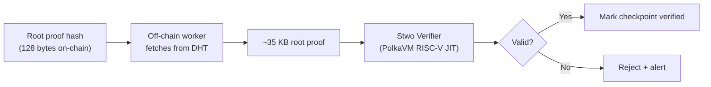

# Stwo Verifier Contract

The **Stwo Verifier Contract** performs on-chain verification of Stwo Circle STARK proofs. Written in Rust `no_std` and compiled to PolkaVM RISC-V bytecode, it achieves **< 10ms verification time** via PolkaVM's JIT compiler.

## Performance

| Metric | Value |
|---|---|
| Verification time | < 10 ms |
| PolkaVM JIT overhead | ~20% vs bare-metal |
| Gas cost | ~300× cheaper than equivalent Ethereum EVM verification |
| Proof size verified | ~35 KB (root proof) |

## Verification Pipeline



## Why RISC-V?

PolkaVM executes RISC-V bytecode with a JIT compiler, achieving ~80% of bare-metal speed. The M31 field arithmetic maps directly to 32-bit RISC-V registers:

- M31 addition: single `add` + conditional `sub` instruction
- M31 multiplication: single `mul` + fast reduction (shift + sub)
- No 256-bit big-integer arithmetic needed (unlike BN254/Groth16)

## Shared Verifier Code

The same Rust `no_std` verification code runs both on-chain and off-chain:

```rust
#![no_std]

/// Verify a Stwo Circle STARK root proof
pub fn verify_root_proof(
    proof: &[u8],
    public_inputs: &PublicInputs,
) -> Result<bool, VerifyError> {
    let parsed = StwoProof::deserialize(proof)?;
    let result = stwo_verify_m31(&parsed, public_inputs)?;
    Ok(result)
}
```

This ensures there is no divergence between off-chain peer-to-peer verification and on-chain settlement verification.
