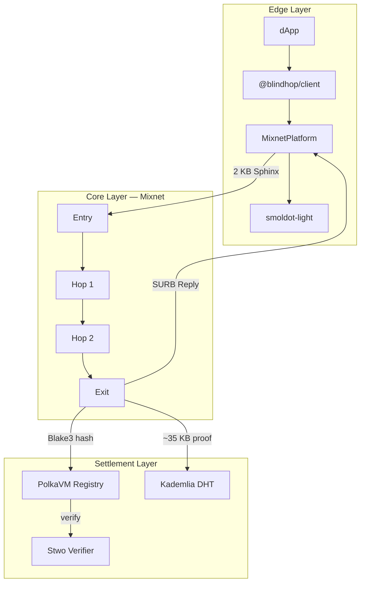

# BlindHop

**Mixnet Privacy Layer for Smoldot Light Clients**

BlindHop is a middleware crate that wraps the [smoldot](https://github.com/smol-dot/smoldot) light client, routing all traffic through a **Sphinx/Loopix mixnet** with **zero-knowledge proofs** powered by [Stwo Circle STARKs](https://github.com/starkware-libs/stwo). It provides:

- 🔒 **Transaction origin hiding** — extrinsic submissions are untraceable to the sender's IP
- 🕵️ **Metadata privacy** — storage queries, block requests, and chain state reads are all anonymized
- 🧮 **Trustless verification** — every mixnode proves correct relay via Stwo Circle STARKs
- 🌐 **Chain-agnostic** — works with Kusama, Polkadot, parachains, and solochains
- 🚫 **No trusted setup** — fully transparent ZK proofs (post-quantum secure)
- ⚡ **No new pallets** — all on-chain logic runs on PolkaVM as Rust smart contracts

## Quick Start

```bash
npm install @blindhop/client
```

```typescript
import { BlindHop } from '@blindhop/client';

const client = await BlindHop.start({
  chainSpec: kusamaChainSpec,
  hopCount: 3,
  privacyMode: 'required',
});

// Use exactly like smoldot — same JSON-RPC interface
const response = await client.sendJsonRpc(
  '{"jsonrpc":"2.0","id":1,"method":"author_submitExtrinsic","params":["0x..."]}'
);
```

## Why BlindHop?

Substrate light clients connect directly to full nodes over libp2p, exposing the user's IP address and linking it to every transaction and query. An ISP, network observer, or malicious full node can trivially correlate **who** is transacting, **what** they're querying, and **when** they're active.

BlindHop eliminates this metadata leakage at the network transport layer — making privacy the **default**, not an opt-in feature.

## Architecture at a Glance



## Design Principles

1. **Performance-first** — Stwo's Mersenne31 field maps to 32-bit RISC-V registers; O(log N) proof aggregation via binary tree
2. **Trustless at every stage** — no trusted setup, no trusted hardware, no trusted third parties
3. **Non-invasive** — wraps smoldot's `PlatformRef` trait; no fork required
4. **Chain-agnostic** — one implementation covers all Substrate chains
5. **Progressive privacy** — configurable hop count (1–5), cover traffic rate, and privacy mode

## License

Apache 2.0 + MIT dual license — same as smoldot and the Substrate ecosystem.
