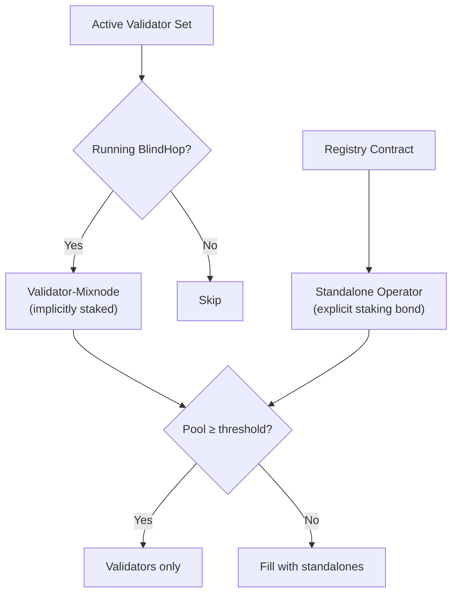

# Mixnode Operator Overview

BlindHop's mixnet is operated by two classes of nodes: **validator-mixnodes** (chain validators running the BlindHop plugin) and **standalone operators** (independent operators who stake a bond).

## Dual-Class Model

### Priority: Validators First

1. **Validators** are always prioritized — they already have economic bonds (staked KSM/DOT)
2. **Standalones** fill remaining slots when validator-mixnodes alone don't meet the anonymity set threshold
3. Both types must pass the same ZK eligibility proof

## Becoming an Operator

### Validator Path
Simply run the `blindhop-full-node` library alongside your Substrate validator. No additional registration needed — BlindHop discovers you from the active validator set.

### Standalone Path
1. Call `register()` on the Registry contract with your staking bond
2. Provide your x25519 public key and endpoint address
3. Pass the ZK eligibility proof (Merkle membership in registry)
4. Begin receiving and relaying Sphinx packets

## Responsibilities

| Duty | Frequency | Consequence of Failure |
|---|---|---|
| Relay Sphinx packets | Continuous | Loss of reputation (future: slashing) |
| Generate cover traffic | Continuous | Slashed (cover compliance proof required) |
| Submit eligibility checkpoint | Every N sessions | Warning → bond reduction → eviction |
| Submit cover compliance proof | Every epoch | Warning → bond reduction → eviction |
| Maintain uptime | Continuous | Removed from cascade after timeout |
