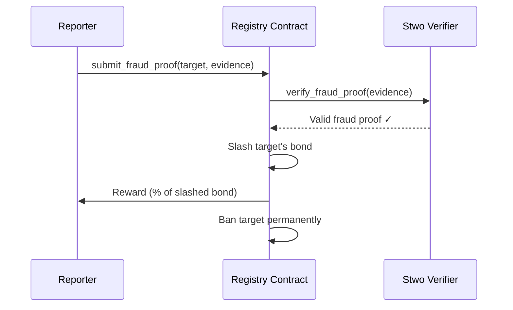

# Slashing Mechanism

BlindHop enforces honest behavior through **economic penalties** (slashing staking bonds) verified by ZK fraud proofs.

## Slashable Offenses

| Offense | Detection | Penalty |
|---|---|---|
| **Packet manipulation** | Fraud proof (invalid relay proof) | 100% bond slashed |
| **Missing cover traffic** | Failed cover compliance proof | 10% per violation → eviction |
| **Missing eligibility checkpoint** | No on-chain proof within deadline | Warning → 10% → eviction |
| **Double-spending a SURB** | SURB nonce collision detected | 50% bond slashed |
| **Key reuse across sessions** | Session key analysis | 100% bond slashed |

## Fraud Proof Submission

Any peer can submit a fraud proof to the Registry contract:

## Slashing Rewards

Reporters receive a percentage of the slashed bond as incentive:
- **Fraud proof reward**: 10% of slashed bond
- **Remaining**: Sent to the chain treasury (or burned)

## Dispute Resolution

The hybrid verification model provides two paths for dispute resolution:

1. **P2P path**: Peers detect misbehavior in real-time and refuse to route through the offending node
2. **On-chain path**: Fraud proof submitted to the Registry contract for permanent resolution and economic penalty
