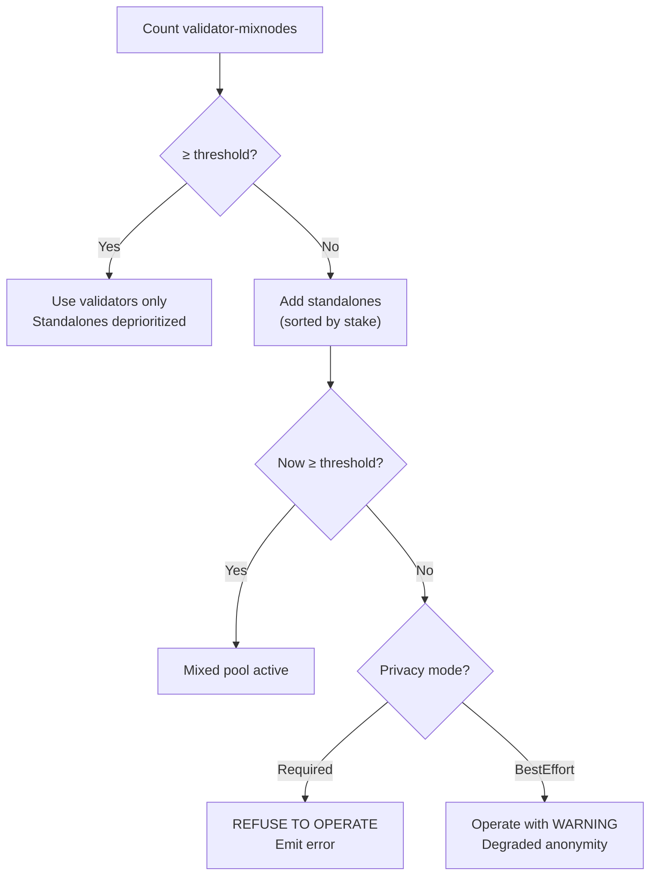

# Anonymity Set Threshold Engine

The threshold engine ensures the mixnet has **enough operators** for meaningful privacy. It is **configurable per-chain**.

## Configuration

```rust
pub struct ThresholdConfig {
    /// Minimum total mixnodes required
    pub min_anonymity_set: u32,

    /// Example values per chain type:
    /// Kusama: 50
    /// Polkadot: 50
    /// Parachain: 20
    /// Solochain: 10
}
```

## Decision Logic



## Privacy Modes

| Mode | Below Threshold Behavior |
|---|---|
| `Required` | Client refuses all connections. No traffic flows. User is notified. |
| `BestEffort` | Client operates with degraded privacy. Emits `privacy-degraded` event. Cover traffic continues. |

## Why Configurable?

Different chains have different privacy requirements:
- **Kusama** (50 validators): Strong anonymity set expected
- **Solochain** (10 validators): Lower threshold acceptable
- **Dev/testing**: Can be set to 1 for local development
