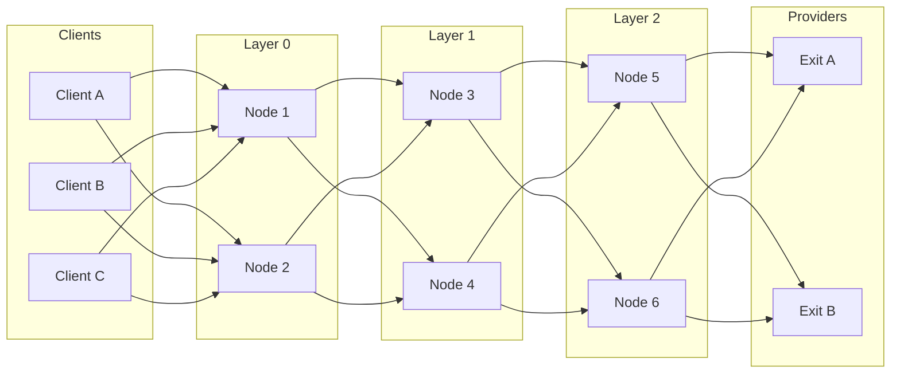

# Loopix Mixing Strategy

BlindHop implements the **Loopix** mixing strategy, which provides strong anonymity guarantees through three mechanisms: stratified topology, Poisson cover traffic, and exponential delays.

## Stratified Cascade

Mixnodes are organized into **L layers** (default: L = hop_count). Each client selects exactly one node per layer:



### Layer Assignment

Mixnodes are assigned to layers using a deterministic function of their public key and the current session number:

```rust
fn assign_layer(node_pubkey: &[u8; 32], session: u64, num_layers: u8) -> u8 {
    let seed = blake3::hash(&[node_pubkey, &session.to_le_bytes()].concat());
    (seed.as_bytes()[0] as u64 % num_layers as u64) as u8
}
```

This ensures:
- Balanced layer distribution
- Deterministic assignment (all clients agree without communication)
- Rotation across sessions (prevents long-term positional attacks)

## Exponential Delays

Each mixnode delays packets by a duration sampled from an **exponential distribution**:

$$
\text{delay} \sim \text{Exp}(\mu) \quad \text{where } \mu \text{ is the rate parameter}
$$

| Parameter | Default | Meaning |
|---|---|---|
| μ (rate) | 2.0 s⁻¹ | Mean delay = 1/μ = 500ms |
| Min delay | 10 ms | Floor to prevent zero delays |
| Max delay | 5,000 ms | Ceiling to prevent stale packets |

### Why Exponential?

The exponential distribution is **memoryless**: knowing how long a packet has waited gives no information about when it will be sent. This property is critical for preventing timing attacks.

$$
P(\text{delay} > t + s \mid \text{delay} > t) = P(\text{delay} > s)
$$

### Delay Seeding

To make delays **sender-predictable** (the client can estimate round-trip time), the delay seed is embedded in the Sphinx routing header:

```rust
fn sample_delay(seed: &[u8; 16], mu: f64) -> Duration {
    let mut rng = ChaCha20Rng::from_seed(expand_seed(seed));
    let delay_ms = Exp::new(1.0 / mu).unwrap().sample(&mut rng);
    Duration::from_millis(delay_ms.clamp(10.0, 5000.0) as u64)
}
```

## Cover Traffic

Cover traffic consists of **dummy packets** that are cryptographically indistinguishable from real packets. Three types exist:

### 1. Client Cover (Loop Messages)

Clients send cover packets that loop through the mixnet and return via SURB:

```
Client → Entry → Hop1 → ... → Exit → (SURB return) → Client
```

- Rate: λ_loop packets/second (configurable, default 0.5)
- Purpose: Maintains constant traffic rate from the client
- The client verifies the loop completed (liveness check for the mixnet)

### 2. Mixnode Cover (Drop Messages)

Each mixnode generates cover packets addressed to random mixnodes:

```
Mixnode_A → Hop1 → ... → Mixnode_B (drops the packet)
```

- Rate: λ_drop packets/second per mixnode
- Purpose: Maintains constant traffic volume within the network
- Dropped silently at the destination (no response needed)

### 3. Mixnode Loop Cover

Each mixnode generates self-addressed loop traffic:

```
Mixnode_A → Hop1 → ... → Mixnode_A (verifies loop)
```

- Rate: λ_loop_node packets/second
- Purpose: Self-monitoring, liveness detection
- Used for cover compliance proofs (ZK proof of traffic volume)

## Traffic Model

At steady state, each link in the network carries:

$$
\text{Total traffic} = \text{Real messages} + \text{Client loops} + \text{Node drops} + \text{Node loops}
$$

An observer sees a **constant Poisson stream** on each link, with rate:

$$
\lambda_{\text{total}} = \lambda_{\text{real}} + \lambda_{\text{cover}}
$$

Since all packets are exactly 2,048 bytes and delays are exponentially distributed, an observer cannot distinguish real from cover traffic by size, timing, or content.

## Security Guarantees

| Attack | Defense |
|---|---|
| **Traffic analysis** | Fixed 2 KB packets + Poisson cover = constant traffic profile |
| **Timing correlation** | Exponential delays destroy timing patterns |
| **Volume analysis** | Cover traffic maintains baseline regardless of real activity |
| **Intersection attack** | Cover loops from clients prevent "goes silent" detection |
| **Compulsion attack** | Mixnodes can't distinguish real from cover (drop analysis yields nothing) |
