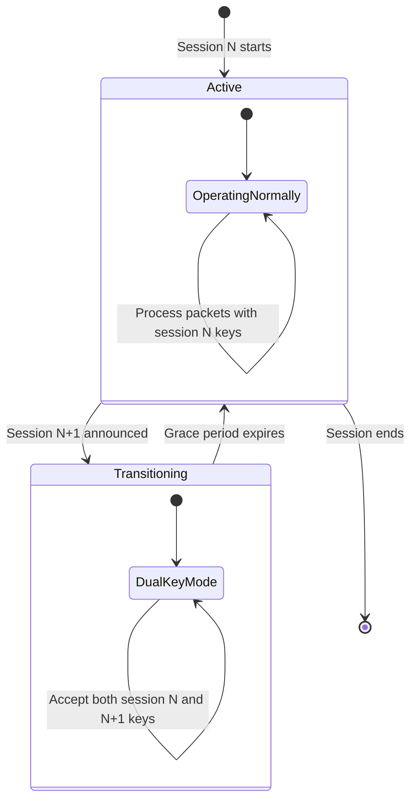

# Session Management

BlindHop's mixnet keys are aligned with Substrate's **session system** — keys rotate each era, and the light client already tracks session changes.

## Session Lifecycle



## Key Rotation

Each mixnode generates fresh **x25519 session keys** per era:

```rust
struct MixnodeSessionKeys {
    /// Current session's keys
    current: SessionKeyPair,
    /// Next session's keys (pre-announced)
    next: Option<SessionKeyPair>,
    /// Previous session's keys (grace period)
    previous: Option<SessionKeyPair>,
}

struct SessionKeyPair {
    secret: x25519::StaticSecret,
    public: x25519::PublicKey,
    session_index: u32,
}
```

### Grace Period

During session transitions, mixnodes accept **both old and new keys** for a configurable grace period (default: 2 blocks). This prevents packet loss during rotation.

## Discovery Sources

The session tracker reads mixnode information from two sources:

1. **Chain state** — active validator set (read via smoldot light client queries)
2. **Registry contract** — standalone operator registrations (PolkaVM contract state)

```rust
pub struct SessionTracker {
    /// Current session index from chain finality
    current_session: u32,

    /// Validator-class mixnodes (from chain session info)
    validator_mixnodes: Vec<MixnodeInfo>,

    /// Standalone mixnodes (from Registry contract)
    standalone_mixnodes: Vec<MixnodeInfo>,

    /// Combined pool after threshold evaluation
    active_pool: Vec<MixnodeInfo>,
}
```

## Client-Side Session Tracking

The light client monitors chain finality for session changes. When a new session is detected:

1. Fetch the new validator set from chain state
2. Query the Registry contract for standalone operators
3. Evaluate the threshold (validators first, standalones fill gaps)
4. Construct new routing tables with fresh public keys
5. Begin dual-key grace period

This is efficient because smoldot already tracks finality — no additional chain queries are needed beyond what the light client normally performs.
