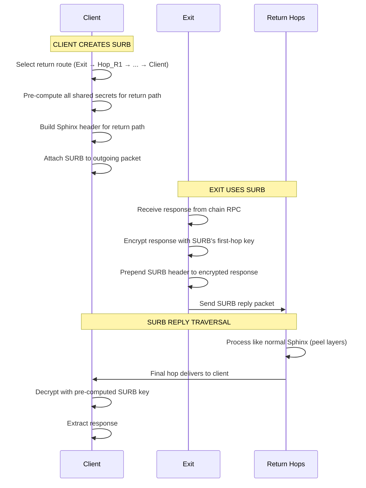

# SURBs — Single-Use Reply Blocks

SURBs enable **anonymous responses** — the exit node can send a reply to the client without knowing the client's identity or IP address.

## How SURBs Work

A SURB is a **pre-built Sphinx header** for the return path, created by the client and attached to the outgoing packet.



## SURB Structure

```rust
pub struct Surb {
    /// Pre-built Sphinx header for the return path
    pub header: SphinxHeader,       // 512 bytes

    /// First-hop address (where the exit sends the reply)
    pub first_hop: SocketAddr,      // 18 bytes

    /// Symmetric key for the exit to encrypt the response
    pub reply_key: [u8; 32],        // AES key

    /// Nonce for the reply encryption
    pub reply_nonce: [u8; 12],      // AES-CTR nonce
}
```

| Field | Size | Description |
|---|---|---|
| Header | 512 bytes | Pre-built routing header for return path |
| First hop | 18 bytes | Address of the first mixnode on the return path |
| Reply key | 32 bytes | AES-256 key for encrypting the response |
| Reply nonce | 12 bytes | AES-CTR nonce |
| **Total** | **~574 bytes** | Embedded in the outgoing Sphinx payload |

## Security Properties

| Property | Guarantee |
|---|---|
| **Sender anonymity** | Exit node doesn't know who the client is |
| **Reply unlinkability** | SURB header is indistinguishable from forward traffic |
| **Single-use** | Each SURB can only be used once (nonce uniqueness) |
| **Forward secrecy** | SURB keys are ephemeral and discarded after use |

## SURB Pool Management

The client maintains a pool of pre-generated SURBs for efficiency:

```rust
pub struct SurbPool {
    /// Ready-to-use SURBs
    available: VecDeque<PreparedSurb>,

    /// SURBs waiting for replies (mapped by identifier)
    pending: HashMap<SurbId, SurbDecryptionKey>,

    /// Maximum pool size
    max_size: usize,  // default: 32

    /// Auto-replenish when pool drops below threshold
    replenish_threshold: usize,  // default: 8
}
```

When the pool drops below the threshold, new SURBs are generated in the background using randomly selected return routes.

## Handling Large Responses

If a response exceeds the 1,504-byte payload capacity, the exit node fragments it across multiple SURB replies. The client must attach **multiple SURBs** to a single request when expecting large responses (e.g., storage queries with large values).

```rust
/// Number of SURBs to attach based on expected response size
fn surbs_needed(expected_response_bytes: usize) -> usize {
    let payload_per_surb = 1504 - 20; // minus fragment header
    (expected_response_bytes + payload_per_surb - 1) / payload_per_surb
}
```
