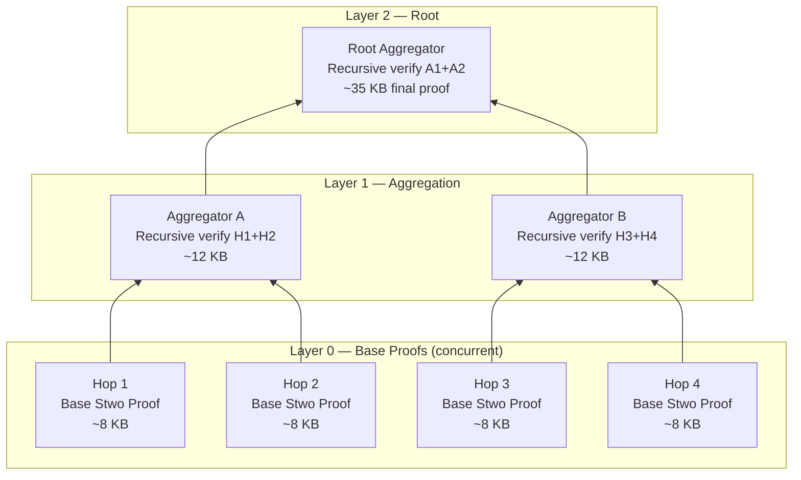

# Recursive Binary Proof Tree

The **Binary Proof Tree** is BlindHop's multi-hop proof aggregation strategy. Instead of sequential folding (O(N)), base proofs from each hop are aggregated in a parallel binary tree, achieving **O(log N) latency**.

## Architecture



## Performance Comparison

| Strategy | Latency | Parallelism | Proof Size |
|---|---|---|---|
| **Sequential folding** | O(N) × prove_time | None | Grows with N |
| **Binary Proof Tree** ✓ | O(log N) × prove_time | Full at each level | Fixed ~35 KB |

For a 5-hop path:
- Sequential: 5 × 100ms = **500ms**
- Binary tree: ⌈log₂(5)⌉ × 100ms = **300ms** (40% faster)

For a 16-hop path (theoretical):
- Sequential: 16 × 100ms = **1,600ms**
- Binary tree: 4 × 100ms = **400ms** (75% faster)

## Aggregation Circuit

The recursive aggregation circuit takes **two inner proofs** and produces **one aggregated proof**:

```rust
/// Recursive aggregation: verify two Stwo proofs inside a new Stwo proof
fn aggregate(proof_a: &StwoProof, proof_b: &StwoProof) -> StwoProof {
    // 1. Verify proof_a's public inputs and commitment
    // 2. Verify proof_b's public inputs and commitment
    // 3. Check that proof_a's output commitment links to proof_b's input
    // 4. Produce new proof attesting to both
    stwo_recursive_verify(proof_a, proof_b)
}
```

## Aggregator Selection

Aggregators are selected **round-robin** from idle mixnodes in the validator/standalone pool:

1. Mixnodes not currently participating in the active cascade for a given packet are eligible
2. Selection rotates each epoch to distribute load
3. Aggregation is lightweight (~100ms per pair) — any modern machine can handle it

## Chain of Trust

The root proof cryptographically attests to:
- Every hop processed its Sphinx packet correctly
- Every hop was an eligible mixnode (membership proof embedded)
- The entire path maintained packet integrity

This single ~35 KB proof replaces N individual proofs, making on-chain verification tractable.
