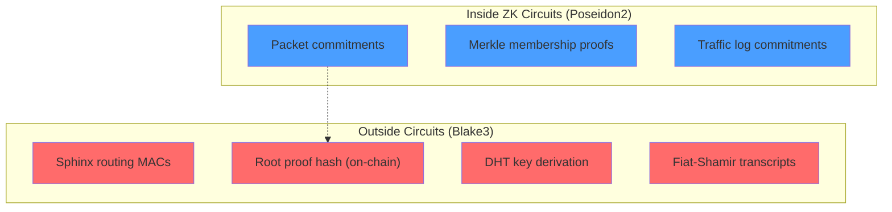

# Dual Hash Strategy

BlindHop uses **two different hash functions** optimized for their respective domains: **Poseidon2** inside ZK circuits and **Blake3** outside circuits.

## Why Two Hashes?

| Hash | Domain | Constraints in ZK | Speed (native) |
|---|---|---|---|
| **Poseidon2 (M31)** | Inside ZK circuits | ~200 per hash | ~100 μs |
| **Blake3** | Outside circuits | ~30,000 per hash | ~10 ns |
| SHA-256 | ❌ Not used | ~30,000 per hash | ~50 ns |

Using SHA-256 inside circuits would make proving **150× more expensive**. Using Poseidon2 outside circuits would be **10,000× slower** than Blake3 for networking.

## Poseidon2 (In-Circuit)

Used for:
- Merkle tree commitments (validator set, registry)
- Packet hash commitments (relay proof public inputs)
- Traffic log commitments (cover compliance proof)
- All ZK circuit internal hashing

Properties:
- Algebraic hash function designed for arithmetic circuits
- ~200 constraints per hash invocation over M31
- Sponge construction with rate 8 and capacity 4 (M31 elements)

## Blake3 (Outside Circuit)

Used for:
- Sphinx routing header MACs
- Network packet integrity checks
- Root proof commitment (on-chain 128-byte hash)
- Kademlia DHT key derivation
- State commitment hashing
- Fiat-Shamir transcript hashing (prover/verifier interaction)

Properties:
- Fastest general-purpose hash function
- SIMD-optimized, hardware-accelerated on modern CPUs
- 256-bit output, tree-based internal structure
- Used as the on-chain commitment for root proofs

## Where Each Hash Appears



## `blindhop-lib/crypto/` Module API

The `crypto/` module in `blindhop-lib` provides wrapper APIs for both hash functions.

### `poseidon2.rs` — In-Circuit Hash

```rust
use blindhop_lib::crypto::poseidon2;

/// Hash a sequence of M31 field elements using the Poseidon2 sponge.
/// Returns a Poseidon2 digest (array of M31 elements).
pub fn hash_m31(input: &[M31]) -> Poseidon2Digest;

/// Build a Poseidon2 Merkle tree from leaf commitments.
/// Used for validator set and registry membership proofs.
pub fn merkle_root(leaves: &[Poseidon2Digest]) -> Poseidon2Digest;

/// Compute a Merkle proof for a leaf at the given index.
pub fn merkle_proof(leaves: &[Poseidon2Digest], index: usize) -> MerkleProof;

/// Verify a Merkle proof against a known root.
pub fn verify_merkle_proof(
    root: &Poseidon2Digest,
    leaf: &Poseidon2Digest,
    proof: &MerkleProof,
) -> bool;
```

### `blake3.rs` — Networking Hash

```rust
use blindhop_lib::crypto::blake3;

/// Hash arbitrary bytes using Blake3. Returns a 32-byte digest.
pub fn hash(input: &[u8]) -> [u8; 32];

/// Keyed Blake3 hash (for Sphinx routing MACs).
pub fn keyed_hash(key: &[u8; 32], input: &[u8]) -> [u8; 32];

/// Derive a DHT key from a root proof digest.
pub fn dht_key(proof_digest: &[u8]) -> [u8; 32];

/// Compute the on-chain commitment (128 bytes) from a root proof.
/// This is the value stored in the Registry contract.
pub fn root_commitment(proof_bytes: &[u8]) -> [u8; 128];

/// Fiat-Shamir transcript hash for prover/verifier interaction.
pub fn transcript_hash(label: &str, data: &[u8]) -> [u8; 32];
```

