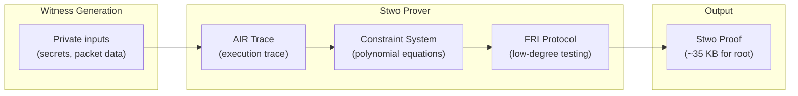

# Stwo Circle STARKs — ZK Proving System

BlindHop uses **Stwo** (by Starkware) as its zero-knowledge proving system. Stwo implements **Circle STARKs** over the **Mersenne31 (M31)** prime field.

## Why Stwo?

| Property | Stwo (Circle STARKs) | Groth16 (SNARKs) | Plonky2/3 |
|---|---|---|---|
| **Trusted setup** | ❌ None (transparent) | ✅ Required | ❌ None |
| **Post-quantum** | ✅ Hash-based | ❌ Pairing-based | ✅ Hash-based |
| **Proof size** | ~35 KB | ~200 bytes | ~50 KB |
| **Prover speed** | Fastest STARK prover | Fast | Fast |
| **Recursion** | ✅ Native | ⚠️ Via cycles | ✅ Via IOP |
| **Field** | M31 (2³¹ - 1) | BN254 | Goldilocks/BabyBear |
| **Hardware alignment** | 32-bit (RISC-V native) | 256-bit | 64-bit |

### Key advantages for BlindHop:

1. **No trusted setup** — eliminates the need for trusted ceremony participants
2. **Post-quantum security** — hash-based commitments resist quantum attacks
3. **M31 field** — 32-bit field elements map directly to PolkaVM's RISC-V 32-bit registers (~80% bare-metal speed)
4. **Native recursion** — purpose-built for the Binary Proof Tree aggregation pattern
5. **Production-proven** — deployed in Starknet's production infrastructure

## Mersenne31 Field

The M31 prime $p = 2^{31} - 1 = 2,147,483,647$ has special properties:

- **32-bit arithmetic** — fits in a single register on RISC-V (PolkaVM)
- **Fast reduction** — modular reduction by M31 is just a shift and subtract
- **Circle group** — supports the Circle STARK protocol over the circle $x^2 + y^2 = 1$ over $\mathbb{F}_p$

```rust
/// M31 field element
#[derive(Copy, Clone)]
pub struct M31(pub u32);

impl M31 {
    pub const P: u32 = (1 << 31) - 1;

    /// Fast modular reduction
    pub fn reduce(x: u64) -> Self {
        let lo = (x & Self::P as u64) as u32;
        let hi = (x >> 31) as u32;
        let sum = lo + hi;
        M31(if sum >= Self::P { sum - Self::P } else { sum })
    }
}
```

## Circuit Architecture

BlindHop defines four ZK circuits, all expressed as **AIR (Algebraic Intermediate Representation)** constraints over M31:

| Circuit | Purpose | Approximate Constraints |
|---|---|---|
| [Relay Proof](/zk/relay-proof) | Correct Sphinx layer processing | ~50K |
| [Eligibility Proof](/zk/eligibility-proof) | Mixnode membership (validator/registry) | ~30K |
| [TX Validity Proof](/zk/tx-validity-proof) | Well-formed extrinsic | ~15K |
| [Cover Compliance Proof](/zk/cover-compliance-proof) | Cover traffic volume compliance | ~10K |

## Proof Pipeline



### Proving Steps

1. **Witness generation** — compute the execution trace from private inputs
2. **Trace commitment** — commit to the trace columns using Poseidon2 Merkle tree
3. **Constraint evaluation** — evaluate AIR constraints as polynomial equations
4. **FRI (Fast Reed-Solomon Interactive Oracle Proof)** — prove the trace is low-degree
5. **Proof composition** — combine all components into a single proof

## Dual Hash Strategy

BlindHop uses two different hash functions depending on context:

| Context | Hash | Rationale |
|---|---|---|
| **Inside ZK circuits** | Poseidon2 (M31) | ~200 constraints per hash (vs ~30K for SHA-256) |
| **Outside circuits** | Blake3 | Fastest general-purpose hash, hardware-accelerated |

This dual approach maximizes both circuit efficiency and networking performance. See [Dual Hash Strategy](/zk/dual-hash-strategy) for details.
