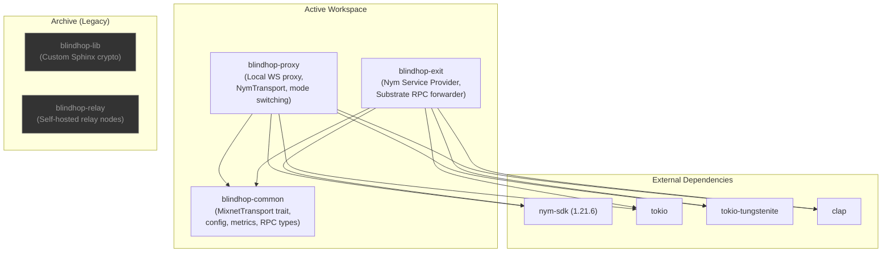

# Crate Structure

BlindHop is organized as a Rust workspace with **3 active crates** plus archived legacy code.

## Dependency Graph



## Crate Descriptions

### `blindhop-common` — Shared Types & Abstractions

The foundational crate containing all shared types, traits, and configuration. No network I/O — pure data structures and abstractions.

| Module | Contents |
|---|---|
| `config.rs` | `BlindHopConfig`, `PrivacyMode` (None/Fast/Full), `ExitBackendType` |
| `error.rs` | Error types for all subsystems (Nym transport, WebSocket, config) |
| `transport.rs` | `MixnetTransport` trait, `PrivacyInfo`, `DirectTransport` stub |
| `rpc.rs` | `JsonRpcRequest`/`Response`, `MixnetMessage` envelope with MessageType |
| `metrics.rs` | Thread-safe `MetricsCollector` with percentile calculation |

### `blindhop-proxy` — Local WebSocket Proxy

The user-facing service that accepts smoldot WebSocket connections and routes traffic through the Nym mixnet.

| Module | Contents |
|---|---|
| `main.rs` | CLI with clap: `--listen`, `--target`, `--privacy-mode`, `--exit-address` |
| `nym_transport.rs` | `NymTransport` — implements `MixnetTransport` via `nym-sdk` |
| `bridge.rs` | WebSocket bridge: smoldot ↔ Nym, with control messages |
| `mode.rs` | `ActiveTransport` enum — runtime switching between None/Fast/Full |

### `blindhop-exit` — Nym Service Provider

A Nym Service Provider that receives mixnet traffic and forwards JSON-RPC requests to Substrate full nodes.

| Module | Contents |
|---|---|
| `main.rs` | CLI with clap: `--target-rpc` |
| `service.rs` | Nym SP message loop — receive, parse, forward, reply |
| `backend.rs` | `ExitBackend` trait + `SubstrateWsBackend` implementation |
| `substrate_rpc.rs` | WebSocket client for Substrate full node connections |

### Archive: `blindhop-lib` (Legacy)

The original custom Sphinx/Loopix cryptography crate, preserved in `archive/lib/` for reference. Includes packet construction, SURB management, cover traffic generation, and delay sampling. **Not used in the current Nym-based architecture.**

### Archive: `blindhop-relay` (Legacy)

The original self-hosted relay node crate, preserved in `archive/relay/`. **Replaced by the Nym mixnet.**

## Repository Layout

```
blindhop/
├── Cargo.toml                      # Workspace root
├── LICENSE-APACHE
├── LICENSE-MIT
├── README.md
│
├── common/                         # blindhop-common
│   ├── Cargo.toml
│   └── src/
│       ├── lib.rs
│       ├── config.rs               # BlindHopConfig, PrivacyMode
│       ├── error.rs                # Error types
│       ├── transport.rs            # MixnetTransport trait
│       ├── rpc.rs                  # JSON-RPC + MixnetMessage types
│       └── metrics.rs              # MetricsCollector
│
├── proxy/                          # blindhop-proxy
│   ├── Cargo.toml
│   └── src/
│       ├── main.rs                 # CLI entry point
│       ├── nym_transport.rs        # NymTransport (nym-sdk wrapper)
│       ├── bridge.rs               # WS bridge + control messages
│       └── mode.rs                 # Privacy mode switching
│
├── exit/                           # blindhop-exit
│   ├── Cargo.toml
│   └── src/
│       ├── main.rs                 # CLI entry point
│       ├── service.rs              # Nym SP message loop
│       ├── backend.rs              # ExitBackend trait
│       └── substrate_rpc.rs        # Substrate WS client
│
├── demo/                           # Browser demo
│   ├── index.html                  # Privacy slider UI
│   ├── style.css                   # Premium dark mode
│   ├── app.js                      # App logic + mode switching
│   └── chart.js                    # Canvas latency chart
│
├── scripts/                        # Convenience scripts
│   ├── run_demo.sh                 # Start proxy + serve demo
│   └── benchmark.sh                # Latency benchmarks
│
├── archive/                        # Legacy code (pre-Nym)
│   ├── lib/                        # Original blindhop-lib (Sphinx)
│   ├── relay/                      # Original blindhop-relay
│   └── benchmarks/
│       └── sphinx_legacy.rs        # Sphinx benchmarks
│
├── docs/                           # Docusaurus documentation site
│   ├── docs/                       # Markdown source
│   └── archive/                    # Archived v1 MVP docs
│
└── tests/                          # Integration tests
```
