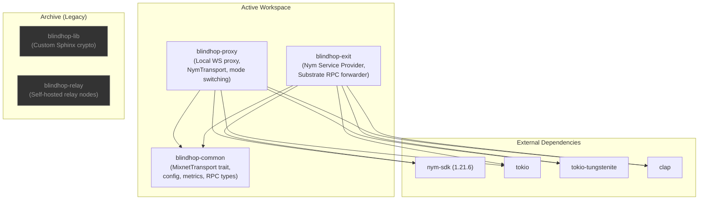

# Crate Structure

BlindHop is organized as a Rust workspace with **3 active crates** plus archived legacy code.

## Dependency Graph



## Crate Descriptions

### `blindhop-common` — Shared Types & Abstractions

The foundational crate containing all shared types, traits, and configuration. No network I/O — pure data structures and abstractions.

| Module | Contents |
|---|---|
| `config.rs` | `BlindHopConfig`, `PrivacyMode` (None/Fast/Full), `ExitBackendType` |
| `error.rs` | Error types for all subsystems (Nym transport, WebSocket, config) |
| `transport.rs` | `MixnetTransport` trait (`request()`), `PrivacyInfo`, `DirectTransport` |
| `rpc.rs` | `JsonRpcRequest`/`Response`, binary frame `MixnetMessage` with correlation IDs & deflate compression |
| `metrics.rs` | Thread-safe `MetricsCollector` with percentile calculation |

### `blindhop-proxy` — Local WebSocket Proxy

The user-facing service that accepts smoldot WebSocket connections and routes traffic through the Nym mixnet.

| Module | Contents |
|---|---|
| `main.rs` | CLI with clap: `--listen`, `--target`, `--privacy-mode`, `--exit-address`, `--allowed-origin`, `--exit-backend`, `--nym-gateway` (accepted but not yet used) |
| `nym_transport.rs` | `NymTransport` — ephemeral Nym client per mode, background receiver matching replies by correlation ID |
| `bridge.rs` | WebSocket bridge: smoldot ↔ Nym, browser origin filtering, control protocol |
| `mode.rs` | `ActiveTransport` enum — runtime switching between None/Fast/Full with reconnect |

### `blindhop-exit` — Nym Service Provider

A hardened Nym Service Provider that receives mixnet traffic and forwards JSON-RPC requests to Substrate full nodes.

| Module | Contents |
|---|---|
| `main.rs` | CLI with clap: `--target-rpc`, `--data-dir`, `--gateway`, `--log-level` |
| `service.rs` | Nym SP message loop, self-probe liveness watchdog, immediate reply delivery |
| `policy.rs` | Request size caps (1 MiB), method allowlist, JSON-RPC error formatting |
| `limiter.rs` | Concurrency limiter (max 16 in flight, 8 per client, 5s queue before busy refusal) |
| `backend.rs` | `ExitBackend` trait + `SubstrateWsBackend` implementation |
| `substrate_rpc.rs` | `UpstreamPool` — pooled WebSocket connections to full node with request ID matching |

### Deploy Scripts & Systemd Unit

Located in `deploy/` for production server hosting:
- `build-exit.sh`: checks build packages, Rust ≥ 1.88 and RAM/swap, then builds with `--locked`
- `install-exit.sh`: creates `blindhop` system user, installs binary, env file, and systemd unit
- `blindhop-exit.service`: hardened systemd unit (isolated filesystem, private `/tmp`, syscall filters, memory/CPU caps)
- `backup-exit-keys.sh`: archives the exit's keys and address file
- `uninstall-exit.sh`: removes the service but keeps the keys (`--purge` deletes them too)

## Repository Layout

```
blindhop/
├── Cargo.toml                      # Workspace root
├── LICENSE-APACHE
├── LICENSE-MIT
├── README.md
│
├── common/                         # blindhop-common
│   ├── Cargo.toml
│   └── src/
│       ├── lib.rs
│       ├── config.rs               # BlindHopConfig, PrivacyMode
│       ├── error.rs                # Error types
│       ├── transport.rs            # MixnetTransport trait
│       ├── rpc.rs                  # JSON-RPC + binary frame types
│       └── metrics.rs              # MetricsCollector
│
├── proxy/                          # blindhop-proxy
│   ├── Cargo.toml
│   ├── benches/                    # Criterion benchmarks
│   └── src/
│       ├── main.rs                 # CLI entry point
│       ├── nym_transport.rs        # NymTransport (correlation ID routing)
│       ├── bridge.rs               # WS bridge + origin check + control messages
│       └── mode.rs                 # Privacy mode switching
│
├── exit/                           # blindhop-exit
│   ├── Cargo.toml
│   └── src/
│       ├── main.rs                 # CLI entry point
│       ├── service.rs              # Nym SP message loop + self-probe watchdog
│       ├── policy.rs               # Method allowlist & payload size limits
│       ├── limiter.rs              # In-flight concurrency limits
│       ├── backend.rs              # ExitBackend trait
│       └── substrate_rpc.rs        # Substrate WS connection pool
│
├── deploy/                         # Production exit deployment
│   ├── README.md                   # Server setup guide
│   ├── build-exit.sh               # Build script
│   ├── install-exit.sh             # Installer script
│   ├── blindhop-exit.service       # Hardened systemd unit
│   ├── backup-exit-keys.sh         # Key backup script
│   └── uninstall-exit.sh           # Uninstaller script
│
├── demo/                           # Browser demo
│   ├── index.html                  # Privacy slider UI
│   ├── style.css                   # Premium dark mode & responsive styles
│   ├── app.js                      # App logic, mode handling, direct comparison toggle
│   ├── chart.js                    # Canvas latency chart (ES module)
│   ├── frame.js                    # Binary frame encoder/decoder & deflate
│   └── nym-client.js               # @nymproject/sdk-full-fat Wasm wrapper
│
├── scripts/                        # Convenience scripts
│   ├── run_exit.sh                 # Start exit service
│   ├── run_proxy.sh                # Start local proxy
│   ├── run_demo.sh                 # Start proxy + serve demo
│   └── benchmark.sh                # Latency benchmarks
│
├── archive/                        # Legacy code (pre-Nym)
│   ├── lib/                        # Original blindhop-lib (Sphinx)
│   └── relay/                      # Original blindhop-relay
│
├── docs/                           # Docusaurus documentation site
│   ├── docs/                       # Markdown source
│   └── archive/                    # Archived v1 MVP docs
│
└── common/tests/                   # Workspace integration tests
    ├── proxy_unit.rs               # Offline config/RPC/frame/metrics tests
    ├── e2e_chain.rs                # Live E2E tests (#[ignore], stubs — TODO)
    └── nym_integration.rs          # Live Nym tests (nym-live feature, stubs — TODO)
```
