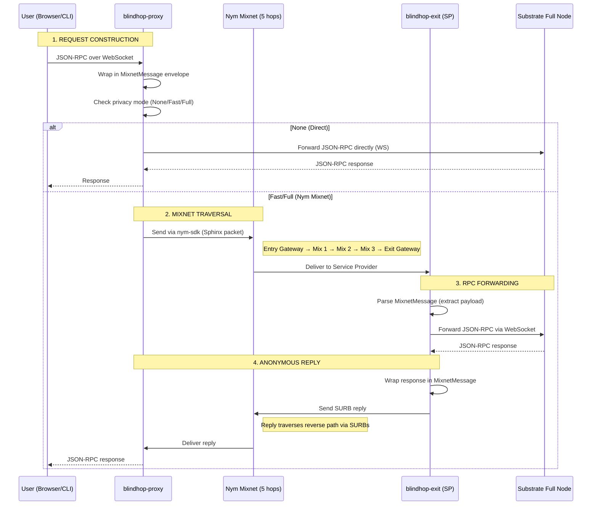

# End-to-End Data Flow

This page traces a single anonymous JSON-RPC request from user to Substrate full node and back.

## Complete Sequence



## Phase-by-Phase Breakdown

### Phase 1: Request Construction (Client Side)

1. The smoldot light client sends a JSON-RPC request to `blindhop-proxy` over WebSocket
2. The proxy checks the current `PrivacyMode`
3. For **None mode**: the request is forwarded directly to the target RPC endpoint
4. For **Fast/Full mode**: the request is wrapped in a `MixnetMessage` envelope:
   ```rust
   pub struct MixnetMessage {
       pub msg_type: MessageType,  // Request or Response
       pub payload: Vec<u8>,       // JSON-RPC bytes
   }
   ```
5. The wrapped message is sent through the Nym SDK client

### Phase 2: Mixnet Traversal

The Nym SDK handles all mixnet operations transparently:

1. The message is split into Sphinx packets (fixed-size, indistinguishable)
2. Each packet traverses 5 mix nodes (Full mode) or 2 (Fast mode)
3. At each hop:
   - The mix node decrypts one Sphinx layer
   - Applies a Poisson-distributed delay (Loopix protocol)
   - Forwards to the next hop
4. Cover traffic (dummy packets) flows continuously, making real traffic indistinguishable

### Phase 3: RPC Forwarding (Exit Service)

1. The `blindhop-exit` receives the message as a Nym Service Provider
2. The `MixnetMessage` envelope is parsed to extract the JSON-RPC payload
3. The `ExitBackend` (default: `SubstrateWsBackend`) forwards the request to the Substrate full node
4. The full node processes the request and returns a response

### Phase 4: Anonymous Reply

1. The exit service wraps the response in a `MixnetMessage` (type: Response)
2. Uses `send_reply()` with the sender's `AnonymousSenderTag` (from SURBs)
3. The reply traverses the mixnet via the pre-built SURB return path
4. The proxy receives the response and forwards it to smoldot

## Latency Budget

| Phase | None | Fast (2-hop) | Full (5-hop) |
|---|---|---|---|
| Proxy overhead | ~1 ms | ~5 ms | ~5 ms |
| Nym SDK processing | — | ~50 ms | ~50 ms |
| Mix node delays | — | ~100-300 ms | ~500-2000 ms |
| Exit processing | — | ~5 ms | ~5 ms |
| Substrate RPC | ~50 ms | ~50 ms | ~50 ms |
| Return path | — | ~100-300 ms | ~500-2000 ms |
| **Total round-trip** | **~50 ms** | **~300-700 ms** | **~1-4 s** |

## MixnetMessage Wire Format

```
┌──────────────────────────────────────┐
│ Version (1 byte)  │ 0x01             │
│ Type (1 byte)     │ 0x00 = Request   │
│                   │ 0x01 = Response  │
│ Payload length    │ u32 big-endian   │
│ Payload           │ JSON-RPC bytes   │
└──────────────────────────────────────┘
```

This envelope is minimal by design — the Nym Sphinx format handles all encryption, padding, and routing.
