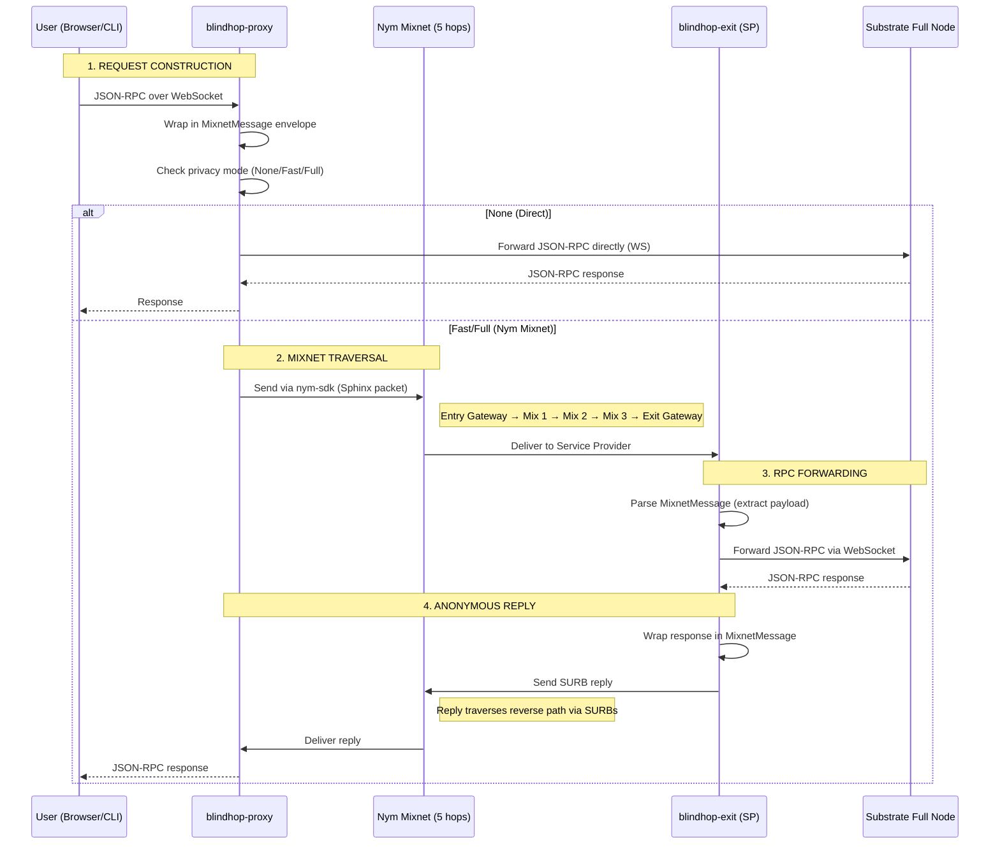

# End-to-End Data Flow

This page traces a single anonymous JSON-RPC request from user to Substrate full node and back.

## Complete Sequence



## Phase-by-Phase Breakdown

### Phase 1: Request Construction (Client Side)

1. The smoldot light client sends a JSON-RPC request to `blindhop-proxy` over WebSocket
2. The proxy checks the current `PrivacyMode`
3. For **None mode**: the request is forwarded directly to the target RPC endpoint
4. For **Fast/Full mode**: the request is wrapped in a binary `MixnetMessage` frame with a unique correlation ID:
   ```rust
   pub struct MixnetMessage {
       pub payload: Vec<u8>,
       pub msg_type: MessageType,
       pub correlation_id: u64,
       pub accepts_compression: bool,
   }
   ```
5. The frame is sent through the Nym SDK client, while the proxy awaits the specific correlation ID on a background receiver task.

### Phase 2: Mixnet Traversal

The Nym SDK handles all mixnet operations transparently:

1. The message is split into Sphinx packets (fixed-size, indistinguishable)
2. Each packet traverses 5 hops (Full mode) or 2 hops (Fast mode: gateway to gateway)
3. At each hop (in Full mode):
   - The mix node decrypts one Sphinx layer
   - Applies a Poisson-distributed delay (Loopix protocol)
   - Forwards to the next hop
4. In Full mode, cover traffic (dummy packets) flows continuously, making real traffic indistinguishable

### Phase 3: RPC Forwarding (Exit Service)

1. The `blindhop-exit` receives the message as a Nym Service Provider
2. Messages without reply SURBs are dropped immediately
3. Policy checks: request size must be ≤ 1 MiB; single JSON-RPC requests with a numeric or string `id` only; method must be in the allowlist
4. Concurrency limiter: acquires a permit (max 16 global concurrent requests, 8 per client tag, waits up to 5s before returning `BUSY -32005`)
5. The request is processed concurrently on its own task using a pooled WebSocket connection (`UpstreamPool`) to the Substrate full node
6. The full node processes the request and returns a response (≤ 4 MiB, 30 s upstream timeout)

### Phase 4: Anonymous Reply

1. If the request set the `0x40` compression flag and the response is ≥ 1 KiB, the exit compresses the payload using raw deflate (only when that makes it smaller)
2. The exit builds a binary response frame containing the same correlation ID
3. The response is sent via `send_reply()` using the sender's anonymous SURB tag
4. The exit sends replies immediately (without Poisson distribution delays) to prevent buffering bottlenecks
5. The reply traverses the mixnet via the pre-built SURB return path
6. The proxy's background receiver decompresses if needed (capped at 8 MiB to prevent decompression bombs), matches the correlation ID, and delivers the response to the waiting caller

## Latency

Measured on Nym mainnet with small requests (e.g. `chain_getHeader`):

| | None | Fast (2-hop) | Full (5-hop) |
|---|---|---|---|
| **Round-trip p50** | RPC node latency (~50–200 ms) | ~1.4–1.8 s | ~2.0 s |
| **Round-trip p90** | — | ~1.5–1.9 s | ~3.1 s |

Where the time goes in Nym modes: the request crosses the entry and exit gateways (plus three mix layers with Poisson delays in Full mode), the exit forwards it over a pooled WebSocket, and the reply returns along the same kind of path on the client's SURBs. Fast mode also skips mix nodes on the return path, since its SURBs are built without mix hops.

Large replies take longer: `state_getMetadata` (~1.2 MB) completes in ~9–11 s in Full mode with deflate compression. The proxy fails a request that gets no reply within 60 s.

## MixnetMessage Wire Format

```
┌────────────────────────────────────────────────────────┐
│ Type byte (1 byte)                                     │
│   0x01 = Request, 0x02 = Response                      │
│   | 0x40 = Accepts compression (client -> exit flag)   │
│   | 0x80 = Payload is raw-deflate compressed           │
├────────────────────────────────────────────────────────┤
│ Correlation ID (8 bytes, big-endian u64)               │
├────────────────────────────────────────────────────────┤
│ Payload (raw JSON-RPC bytes or compressed bytes)       │
└────────────────────────────────────────────────────────┘
```

This 9-byte header replaces earlier JSON serialization, cutting payload overhead by ~3.5× and enabling raw deflate compression for large responses. (For backwards compatibility, incoming messages starting with `{` are still parsed as legacy JSON envelopes).
