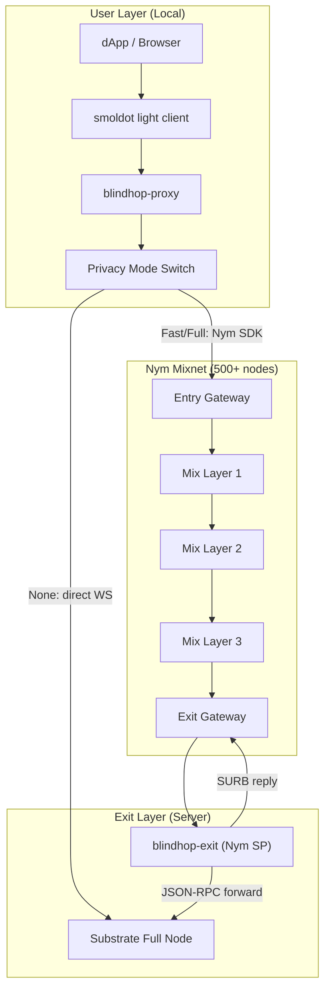

# Architecture Overview

BlindHop uses a **2-tier architecture** built on the Nym production mixnet, separating concerns between the local proxy and the exit service.

## System Diagram



## User Layer

The **User Layer** runs on the user's machine (browser or CLI). It is responsible for:

| Responsibility | Implementation |
|---|---|
| Accepting smoldot connections | `blindhop-proxy` listens on a local WebSocket |
| Privacy mode selection | None (direct), Fast (2-hop), Full (5-hop) |
| Nym client management | `NymTransport` wraps `nym-sdk` client |
| Metrics collection | Real-time latency, message counts, overhead tracking |
| Control protocol | `blindhop_setPrivacyMode`, `blindhop_getMetrics` |

**Key trait**: `MixnetTransport` — the pluggable backend interface defined in `blindhop-common`.

```rust
#[async_trait]
pub trait MixnetTransport: Send + Sync {
    /// Send a request through the mixnet and wait for the reply to that
    /// specific request (matched by correlation ID).
    async fn request(&self, data: &[u8]) -> Result<Vec<u8>>;
    fn privacy_info(&self) -> PrivacyInfo;
    fn metrics(&self) -> TransportMetrics;
    fn is_connected(&self) -> bool;
    async fn disconnect(&self) -> Result<()>;
}
```

A transport's mode is fixed at connect time; switching privacy modes reconnects with a newly configured transport.

## Nym Mixnet Layer

The **Nym Mixnet** is the core privacy infrastructure — a production network of 500+ mix nodes.

| Feature | Details |
|---|---|
| Packet format | Sphinx (fixed-size, indistinguishable from cover traffic) |
| Routing | 5-hop stratified cascade (Full mode) or 2-hop (Fast mode: gateway → gateway) |
| Cover traffic | Loopix protocol — Poisson-distributed dummy packets (Full mode) |
| Reply mechanism | SURBs (Single-Use Reply Blocks) for anonymous responses |
| Network size | 500+ mix nodes across 3 layers + gateways |
| Authentication | zk-nyms (Coconut credentials) for bandwidth allocation |

**Key advantage over self-hosted relays**: Real anonymity set. With 500+ nodes and thousands of users, traffic analysis is infeasible.

## Exit Layer

The **Exit Layer** runs as a hardened Nym Service Provider on a server with access to Substrate full nodes.

| Responsibility | Implementation |
|---|---|
| Receive mixnet traffic | Nym SP message loop with self-probe watchdog |
| Policy & rate limits | Allowlist of read-only methods + `author_submitExtrinsic`; 16 concurrent requests (8/client) with 5s slot queue |
| Parse MixnetMessage frames | Binary frame `[type u8][correlation_id u64 BE][payload]`, optional raw-deflate compression |
| Forward to Substrate | Pooled WebSocket connections (`UpstreamPool`) with request ID matching |
| Return responses | SURB reply through the mixnet with immediate delivery |

**Key trait**: `ExitBackend` — pluggable RPC forwarding backend.

```rust
#[async_trait]
pub trait ExitBackend: Send + Sync {
    async fn forward_rpc(&self, request: &[u8], id: &serde_json::Value) -> Result<Vec<u8>>;
    fn backend_type(&self) -> &str;
}
```

## Data Flow Summary

1. **User submits JSON-RPC** → smoldot sends to `blindhop-proxy`
2. **Proxy wraps in MixnetMessage** → sends through Nym SDK to exit service
3. **5-hop Sphinx traversal** → each mix node decrypts one layer, adds delay, forwards
4. **Exit service receives** → parses payload, forwards JSON-RPC to Substrate full node
5. **Full node responds** → exit wraps response in SURB reply
6. **Reply traverses mixnet** → anonymous return path via pre-built SURBs
7. **Proxy receives response** → forwards to smoldot → user gets result

## Privacy Guarantees by Mode

| Property | None | Fast | Full |
|----------|------|------|------|
| IP hidden from full node | ✗ | ✓ | ✓ |
| Traffic timing hidden | ✗ | ✗ | ✓ |
| Cover traffic active | ✗ | ✗ | ✓ |
| Packet uniformity | ✗ | ✓ | ✓ |
| SURB replies | ✗ | ✓ | ✓ |
| Anonymity set | 0 | ~100 | ~500+ |
