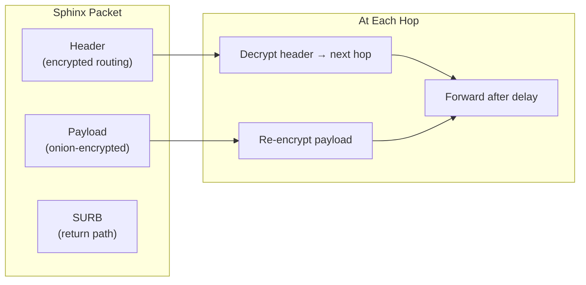

# Nym Integration Deep Dive

## Why Nym?

BlindHop originally used a custom Sphinx/Loopix implementation with self-hosted relay nodes. This approach had fundamental limitations:

| Problem | Custom Relays | Nym Mixnet |
|---------|--------------|------------|
| Anonymity set | 3 nodes (trivial) | 500+ nodes (real privacy) |
| Infrastructure | Must self-host | Existing production network |
| Maintenance | Custom crypto to audit | Battle-tested, audited SDK |
| Cover traffic | Custom implementation | Built-in Loopix protocol |
| Network effect | No other users | Thousands of concurrent users |

## Nym SDK Integration

BlindHop uses `nym-sdk` (v1.21.6) from crates.io for all mixnet operations.

### Client Connection (Proxy)

```rust
use nym_sdk::mixnet::{MixnetClientBuilder, MixnetMessageSender, Recipient};

// Ephemeral client configured per privacy mode (Fast: mix hops & cover traffic disabled)
let mut config = nym_sdk::DebugConfig::default();
if mode == PrivacyMode::Fast {
    config.traffic.disable_mix_hops = true;
    config.cover_traffic.disable_loop_cover_traffic_stream = true;
    config.traffic.disable_main_poisson_packet_distribution = true;
}

let client = MixnetClientBuilder::new_ephemeral()
    .debug_config(config)
    .build()?
    .connect_to_mixnet()
    .await?;

// Send request encoded in binary frame [type | correlation_id | payload]
// Replies are routed to individual callers by correlation ID via a background receiver task.
let reply = transport.request(&json_rpc_bytes).await?;
```

### Service Provider (Exit)

```rust
use nym_sdk::mixnet::{MixnetClientBuilder, StoragePaths};

// Exit connects with persistent on-disk keys to keep its Nym address stable across restarts
let storage_paths = StoragePaths::new_from_dir(&data_dir)?;
let mut config = nym_sdk::DebugConfig::default();
config.traffic.disable_main_poisson_packet_distribution = true; // send replies immediately
config.reply_surbs.maximum_reply_surb_request_size = 500;       // large replies need many SURBs

let mut builder = MixnetClientBuilder::new_with_default_storage(storage_paths)
    .await?
    .debug_config(config);
if let Some(gateway) = gateway {
    builder = builder.request_gateway(gateway); // --gateway
}
let mut client = builder.build()?.connect_to_mixnet().await?;

println!("Exit service Nym address: {}", client.nym_address());

// Process incoming messages concurrently on separate tasks:
// - Check method against allowlist and payload limits (≤ 1 MiB)
// - Acquire rate-limiting permit (max 16 global, 8 per client, 5s queue)
// - Forward to full node via pooled WebSocket connection
// - Compress response (raw deflate) if requested, and send via SURB
```

## Sphinx Packet Format

Nym uses the Sphinx packet format for all mixnet traffic:

- **Fixed size**: All packets are the same size (indistinguishable)
- **Layered encryption**: Each hop peels one layer (x25519 + AES)
- **Routing headers**: Encrypted per-hop, revealing only the next destination
- **SURBs**: Pre-built return paths attached to requests



## Loopix Cover Traffic

In **Full mode**, the Nym client generates cover traffic using the Loopix protocol:

- **Loop cover**: Packets sent to yourself through the mixnet
- **Drop cover**: Packets sent to random mix nodes (discarded)
- **Poisson distribution**: Cover packets are indistinguishable from real traffic in timing

This prevents a network observer from determining when a user is actually active.

## Privacy Mode Mapping

| BlindHop Mode | Nym Configuration |
|---------------|-------------------|
| **None** | No Nym client; direct WebSocket to full node |
| **Fast** | Nym client with reduced hops (gateway → 1 mix → gateway) |
| **Full** | Nym client with full 5-hop path + cover traffic enabled |

## SURB Reply Mechanism

SURBs (Single-Use Reply Blocks) allow anonymous replies:

1. The proxy pre-builds return paths when sending requests
2. Each SURB contains encrypted routing information for the return journey
3. The exit service uses `send_reply(sender_tag, response)` — it never learns the proxy's IP
4. Each SURB is single-use (prevents replay attacks)

## Key Advantages

1. **No custom cryptography** — Nym handles all Sphinx operations
2. **Production-grade** — 500+ nodes, professionally operated, regularly audited
3. **Network effect** — traffic mixes with all other Nym users
4. **Cover traffic** — built-in Loopix protocol
5. **Credential system** — zk-nyms (Coconut credentials) for bandwidth allocation
6. **Maintained** — active development team, regular SDK updates
