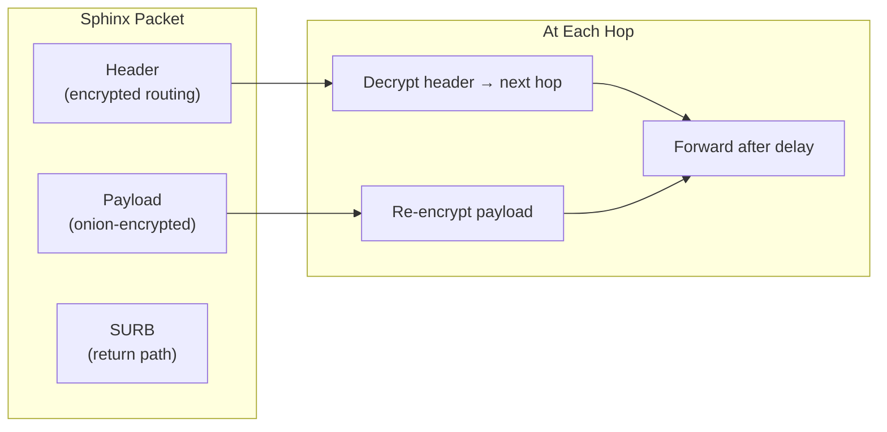

# Nym Integration Deep Dive

## Why Nym?

BlindHop originally used a custom Sphinx/Loopix implementation with self-hosted relay nodes. This approach had fundamental limitations:

| Problem | Custom Relays | Nym Mixnet |
|---------|--------------|------------|
| Anonymity set | 3 nodes (trivial) | 500+ nodes (real privacy) |
| Infrastructure | Must self-host | Existing production network |
| Maintenance | Custom crypto to audit | Battle-tested, audited SDK |
| Cover traffic | Custom implementation | Built-in Loopix protocol |
| Network effect | No other users | Thousands of concurrent users |

## Nym SDK Integration

BlindHop uses `nym-sdk` (v1.21.6) from crates.io for all mixnet operations.

### Client Connection (Proxy)

```rust
use nym_sdk::mixnet::{MixnetClient, MixnetMessageSender, Recipient};

// Connect to the Nym mixnet
let mut client = MixnetClient::connect_new().await?;
let our_address = client.nym_address();

// Send a message to the exit service
let recipient = Recipient::try_from_base58_string(&exit_address)?;
client.send_plain_message(recipient, message_bytes).await?;

// Receive reply (via SURBs)
let messages = client.wait_for_messages().await;
```

### Service Provider (Exit)

```rust
use nym_sdk::mixnet::{MixnetClient, MixnetMessageSender};

// Connect as a Service Provider
let mut client = MixnetClient::connect_new().await?;
let our_address = client.nym_address();
println!("Exit service Nym address: {}", our_address);

// Process incoming messages
loop {
    let messages = client.wait_for_messages().await
        .ok_or("channel closed")?;

    for msg in messages {
        let payload = parse_mixnet_message(&msg.message);
        let response = forward_to_substrate(&payload).await;

        // Reply via SURB (anonymous)
        if let Some(tag) = msg.sender_tag {
            client.send_reply(tag, response).await?;
        }
    }
}
```

## Sphinx Packet Format

Nym uses the Sphinx packet format for all mixnet traffic:

- **Fixed size**: All packets are the same size (indistinguishable)
- **Layered encryption**: Each hop peels one layer (x25519 + AES)
- **Routing headers**: Encrypted per-hop, revealing only the next destination
- **SURBs**: Pre-built return paths attached to requests



## Loopix Cover Traffic

In **Full mode**, the Nym client generates cover traffic using the Loopix protocol:

- **Loop cover**: Packets sent to yourself through the mixnet
- **Drop cover**: Packets sent to random mix nodes (discarded)
- **Poisson distribution**: Cover packets are indistinguishable from real traffic in timing

This prevents a network observer from determining when a user is actually active.

## Privacy Mode Mapping

| BlindHop Mode | Nym Configuration |
|---------------|-------------------|
| **None** | No Nym client; direct WebSocket to full node |
| **Fast** | Nym client with reduced hops (gateway → 1 mix → gateway) |
| **Full** | Nym client with full 5-hop path + cover traffic enabled |

## SURB Reply Mechanism

SURBs (Single-Use Reply Blocks) allow anonymous replies:

1. The proxy pre-builds return paths when sending requests
2. Each SURB contains encrypted routing information for the return journey
3. The exit service uses `send_reply(sender_tag, response)` — it never learns the proxy's IP
4. Each SURB is single-use (prevents replay attacks)

## Key Advantages

1. **No custom cryptography** — Nym handles all Sphinx operations
2. **Production-grade** — 500+ nodes, professionally operated, regularly audited
3. **Network effect** — traffic mixes with all other Nym users
4. **Cover traffic** — built-in Loopix protocol
5. **Credential system** — zk-nyms (Coconut credentials) for bandwidth allocation
6. **Maintained** — active development team, regular SDK updates
