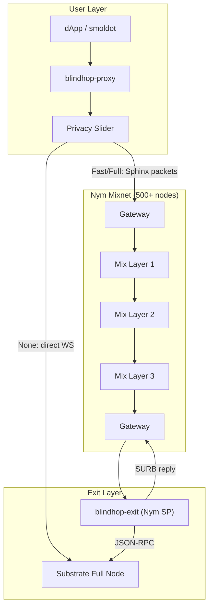

# BlindHop

**Mixnet Privacy Layer for Smoldot Light Clients**

BlindHop is a middleware system that wraps the [smoldot](https://github.com/smol-dot/smoldot) light client, routing all traffic through the [Nym mixnet](https://nymtech.net) — a production network of 500+ mix nodes providing strong metadata privacy. It provides:

- 🔒 **Transaction origin hiding** — extrinsic submissions are untraceable to the sender's IP
- 🕵️ **Metadata privacy** — storage queries, block requests, and chain state reads are all anonymized
- 🌐 **Production mixnet** — 500+ Nym mix nodes, battle-tested Sphinx packet format, Loopix cover traffic
- ⚡ **Privacy slider** — users choose between None (direct), Fast (2-hop), and Full (5-hop mixnet)
- 🔧 **Modular exit** — dedicated service provider or Nym SOCKS5 fallback
- 🌐 **Chain-agnostic** — works with Kusama, Polkadot, parachains, and solochains

## Quick Start

```bash
# Build the workspace
cargo build --workspace

# Start exit service (on server)
cargo run -p blindhop-exit -- --target-rpc wss://sys.turboflakes.io/asset-hub-paseo

# Start proxy (on user machine)
cargo run -p blindhop-proxy -- --privacy-mode full --exit-address <NYM_ADDRESS>
```

## Why BlindHop?

Substrate light clients connect directly to full nodes over libp2p, exposing the user's IP address and linking it to every transaction and query. An ISP, network observer, or malicious full node can trivially correlate **who** is transacting, **what** they're querying, and **when** they're active.

BlindHop eliminates this metadata leakage at the network transport layer — making privacy the **default**, not an opt-in feature.

## Architecture at a Glance



## Design Principles

1. **Leverage existing infrastructure** — Nym's 500+ node mixnet provides a real anonymity set, unlike self-hosted relays
2. **Performance-first** — privacy slider lets users trade latency for anonymity
3. **Modular architecture** — `MixnetTransport` trait allows plugging in custom backends
4. **Non-invasive** — local WebSocket proxy; no smoldot fork required
5. **Chain-agnostic** — one implementation covers all Substrate chains
6. **Progressive privacy** — configurable modes: None → Fast (2-hop) → Full (5-hop mixnet + cover traffic)

## Privacy Modes

| Mode | Hops | Cover Traffic | Latency Overhead | IP Hidden | Metadata Private |
|------|------|--------------|------------------|-----------|-----------------|
| **None** | 0 | ✗ | 0ms | ✗ | ✗ |
| **Fast** | 2 | ✗ | ~200-500ms | ✓ | ✗ |
| **Full** | 5 | ✓ (Loopix) | ~1-3s | ✓ | ✓ |

## License

Apache 2.0 + MIT dual license — same as smoldot and the Substrate ecosystem.
