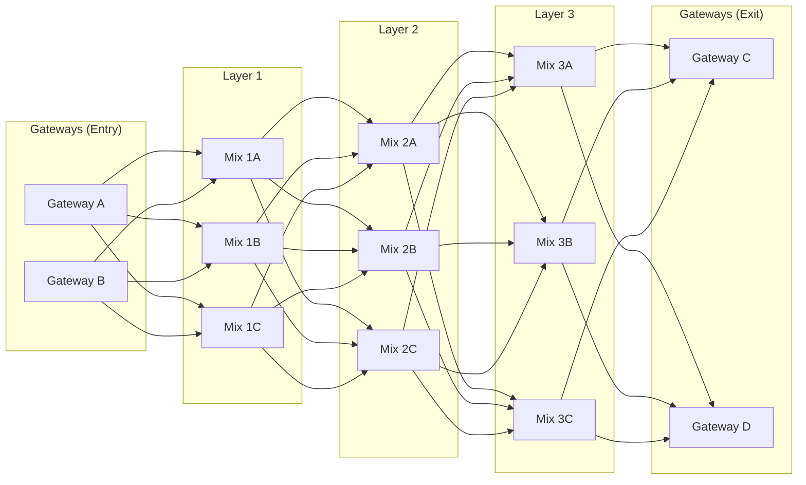

# Loopix Deep Dive

The Nym mixnet implements the [Loopix](https://arxiv.org/abs/1703.00536) anonymous communication protocol. This page covers the protocol details relevant to BlindHop.

## Stratified Cascade Topology

Nym organizes mix nodes into **layers** forming a cascade:

The client randomly selects **one node per layer**, constructing a path like `G1 → M2 → N1 → O3 → H2`.

## Poisson Mixing

At each hop, mix nodes apply a **Poisson delay**:

- Packets are reordered (prevents timing correlation)
- The delay distribution is memoryless (observing one delay gives no information about future delays)
- Combined with cover traffic, this makes traffic analysis infeasible

## Security Properties

| Property | Guarantee |
|----------|-----------|
| **Sender anonymity** | No entity knows both sender IP and message content |
| **Receiver anonymity** | Exit service knows content but not sender |
| **Unlinkability** | Cannot link input/output packets at any hop |
| **Unobservability** | Real traffic is indistinguishable from cover traffic |

## BlindHop's Use of Loopix

BlindHop relies entirely on Nym's Loopix implementation. The `nym-sdk` manages:
- Cover traffic generation and rate control
- Mix node selection and route construction
- Sphinx packet creation and SURB management
- Gateway connection and message delivery

BlindHop adds the **application layer** on top: JSON-RPC message wrapping, privacy mode switching, and Substrate-specific exit service logic.
