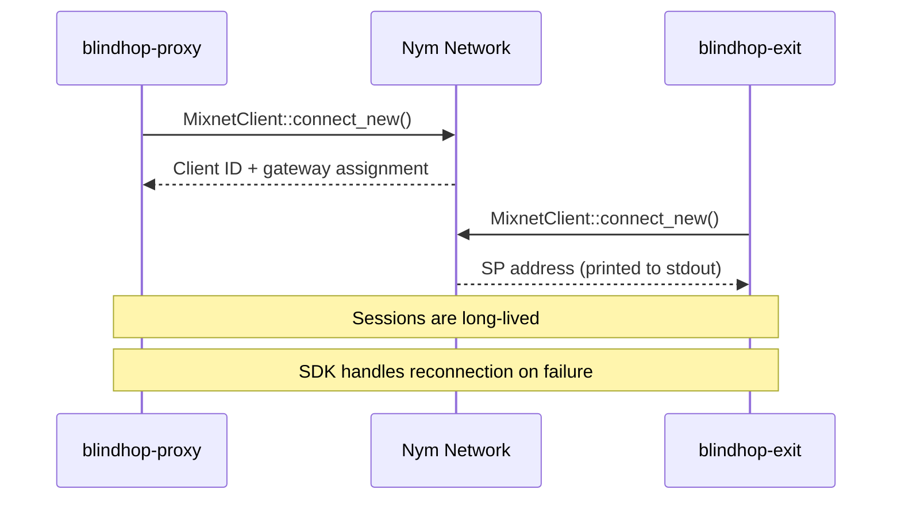

# Session Management

## Nym Client Sessions

The Nym SDK manages cryptographic sessions automatically. When `blindhop-proxy` or `blindhop-exit` connects to the Nym mixnet, the SDK:

1. **Generates a client identity** — x25519 keypair for Sphinx operations
2. **Selects a gateway** — connects to a Nym gateway node
3. **Registers with the network** — announces availability for message receipt
4. **Manages key rotation** — handles periodic key updates

## BlindHop Session Lifecycle

## Privacy Mode Switching

When the user switches privacy modes (via slider or `blindhop_setPrivacyMode`), the proxy handles the transition:

| Transition | Action |
|-----------|--------|
| None → Fast/Full | Initialize Nym client if not already connected |
| Fast → Full | Adjust cover traffic parameters |
| Full → Fast | Reduce cover traffic |
| Fast/Full → None | Route traffic directly (Nym client stays connected for fast switching) |

## Persistence

The Nym SDK stores client identity data in `.nym/` directory, allowing session resumption across restarts without generating a new identity.
