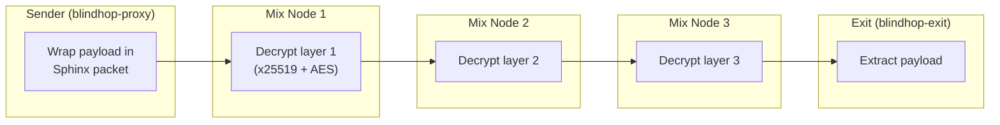

# Sphinx Protocol

BlindHop leverages the Nym mixnet's built-in Sphinx packet format. This page describes how Sphinx works conceptually — BlindHop does **not** implement its own Sphinx; the `nym-sdk` handles all packet operations.

## Overview

Sphinx is a cryptographic packet format for mix networks that provides:
- **Unlinkability**: Packets at each hop look completely different
- **Fixed size**: All packets are identical in size (prevents traffic analysis)
- **Bitwise unlinkability**: Input and output packets share no common bits

## How It Works

Each mix node:
1. Receives a fixed-size packet
2. Derives a shared secret via x25519 ECDH
3. Decrypts the routing header to find the next hop
4. Removes one encryption layer from the payload
5. Outputs a packet that is bitwise unrelated to the input

## Relevance to BlindHop

The `nym-sdk` handles all Sphinx operations transparently. BlindHop's `NymTransport` simply calls:
- `client.send_plain_message(recipient, data)` — SDK wraps in Sphinx
- `client.wait_for_messages()` — SDK unwraps Sphinx reply

No custom Sphinx implementation is needed.
